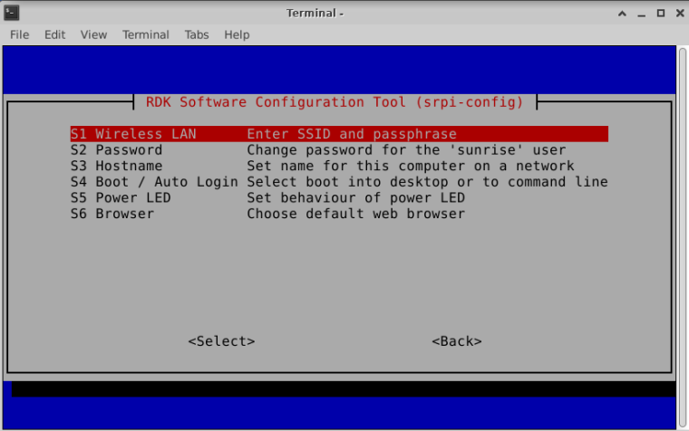

# 1.3 入门配置

:::tip

本章节介绍的入门配置方式仅支持在 RDK X3 、RDK X5 和 RDK X3 Module 型号的开发板上使用；

系统版本不低于 `2.1.0`。

:::

```mdx-code-block
import Tabs from '@theme/Tabs';
import TabItem from '@theme/TabItem';
```

## 连接Wi-Fi

<Tabs groupId="rdk-type">
<TabItem value="desktop" label="Desktop">

使用菜单栏右上角的Wi-Fi管理工具连接Wi-Fi，如下图所示，点击需要连接的Wi-Fi名，然后在弹出的对话框中输入Wi-Fi密码。


</TabItem>

<TabItem value="server" label="Server">

使用srpi-config工具连接Wi-Fi。

执行 `sudo srpi-config` 命令，选择 System Options -> Wireless LAN ，根据提示依次输入Wi-Fi名（`SSID`） 和 密码（`passwd`）。



</TabItem>
</Tabs>

## 开启SSH服务

当前系统版本默认开启 SSH 登录服务，用户可以使用本方法开、关 SSH 服务。

<Tabs groupId="rdk-type">
<TabItem value="desktop" label="Desktop">

通过菜单栏找到`RDK Configuration` 项，点击打开。


选择 Interface Options -> SSH 项，根据提示选择使能或者关闭 `SSH` 服务。


</TabItem>

<TabItem value="server" label="Server">

执行 `sudo srpi-config`命令进入配置菜单。选择 Interface Options -> SSH 项，根据提示选择使能或者关闭 `SSH` 服务。


</TabItem>

</Tabs>

SSH的使用请查看 [远程登录 - SSH登录](./remote_login#ssh)。

## 开启VNC服务

<Tabs groupId="rdk-type">
<TabItem value="desktop" label="Desktop">

通过菜单栏找到`RDK Configuration` 项，点击打开。


选择 Interface Options -> VNC 项，根据提示选择使能或者关闭`VNC` 服务。选择使能 `VNC` 时需要设置登录密码，密码必须是一个8位长度的由字符组成的字符串。


</TabItem>
</Tabs>

VNC 的使用请查看 [远程登录 - VNC登录](./remote_login#vnc登录)。

## 设置登录模式

<Tabs groupId="rdk-type">
<TabItem value="desktop" label="Desktop">

桌面图形化系统，支持四种登录模式：

1. 开启图形化界面，自动登录
2. 开启图形化界面，用户手动登录
3. 字符终端，自动登录
4. 字符终端，用户手动登录

通过菜单栏找到`RDK Configuration` 项，点击打开。选择 System Options -> Boot / Auto Login 项进入如下配置项。根据需求选择对应项。


重启后生效。

</TabItem>

<TabItem value="server" label="Server">

桌面图形化系统，支持四种登录模式：

1. 字符终端，自动登录
2. 字符终端，用户手动登录

执行 `sudo srpi-config`命令进入配置菜单。选择 System Options -> Boot / Auto Login 项进入如下配置项。根据需求选择对应项。

重启后生效。

</TabItem>
</Tabs>

## 设置中文环境

<Tabs groupId="rdk-type">
<TabItem value="desktop" label="Desktop">

通过菜单栏找到`RDK Configuration` 项，点击打开。选择 Localisation Options -> Locale 项进入如下配置。

第一步：选择选择需要用到的语言环境（多选），一般选中 `en_US.UTF-8 UTF-8` 和 `zh_CN.UTF-8 UTF-8`两项即可。回车确认进入下一步。


第二步：选择默认的语言环境，中文环境选择 `zh_CN.UTF-8 UTF-8` 即可。回车确认后需要等待一会完成配置。

第三步：重启开发板，使最新配置生效。`sudo reboot`

:::tip

开机会提示：要不要更新home目录下的几个常用文件夹的名称。
建议选择 `Don't ask me again` `Keep Old Name`， 这样可以保持用户工作目录下的 `Desktop  Documents  Downloads` 等目录名不随语言环境发生变化。

:::

</TabItem>

<TabItem value="server" label="Server">

执行 `sudo srpi-config`命令进入配置菜单。选择 Localisation Options -> Locale 项进入如下配置。

第一步：选择选择需要用到的语言环境（多选），一般选中 `en_US.UTF-8 UTF-8` 和 `zh_CN.UTF-8 UTF-8`两项即可。回车确认进入下一步。


第二步：选择默认的语言环境，中文环境选择 `zh_CN.UTF-8 UTF-8` 即可。回车确认后需要等待一会完成配置。

第三步：重启开发板，使最新配置生效。`sudo reboot`

</TabItem>
</Tabs>

## 设置RDK Studio

<Tabs groupId="rdk-type">
<TabItem value="windows" label="Windows">

RDK Studio为RDK使用者提供了丰富的功能以及便利，其中包括设备管理、Demo快速入手、社区论坛快速访问等功能，接下来为大家介绍如何统一管理使用自己的RDX。

第一步：下载RDK Studio (链接：[下载链接](https://developer.d-robotics.cc/rdkstudio))，点击下载后，页面会滚动到底部下载位置，下载User Installer与ZIP均可，按照安装步骤依次线下安装。


第二步：打开Studio之后界面包含四个左侧菜单具体如下：

​	（1）`设备管理`：在此处你可以通过右上角的`+RDK设备` 进行添加设备进行管理（此处示范使用局域网IP进行连接）。

​	（2）`示例应用`：在此处你可以直接安装一些简单Demo到你的开发板上。

​	（3）`社区`：此处为大家提供了地瓜机器人社区直达访问，大家无需再开启网页进行查阅。

​	（4）`NodeHub`：此处为大家提供了NodeHub直达访问，提供了丰富封装的示例节点。

​	（5）`烧写`：请见1.2章节系统烧录


第三步：Studio 集成工具的使用

​	（1）`终端使用`：点击终端按钮，会自动弹起Windows终端，输入密码即可自动连接

​	（2）`Vscode使用`：点击Vscode图标，即可自动调用本地Vscode Remote插件进行连接（PS：自己本地要有安装Vsocode与插件）

​	（3）`其他功能`：其他Jupyter等需要安装功能，小伙伴们可以按需安装。


</TabItem>

<TabItem value="linux" label="Linux">

:::tip

目前RDK Studio Windows系统已正式出炉，使用Linux和Mac的小伙伴们，稍微等等开发小哥正在火速敲键盘

:::

</TabItem>


<TabItem value="mac" label="Mac">

:::tip

目前RDK Studio Windows系统已正式出炉，使用Linux和Mac的小伙伴们，稍微等等开发小哥正在火速敲键盘

:::

</TabItem>

</Tabs>