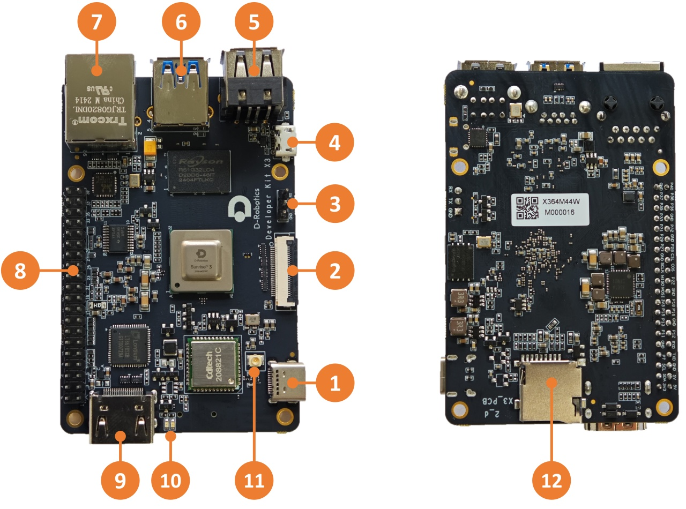
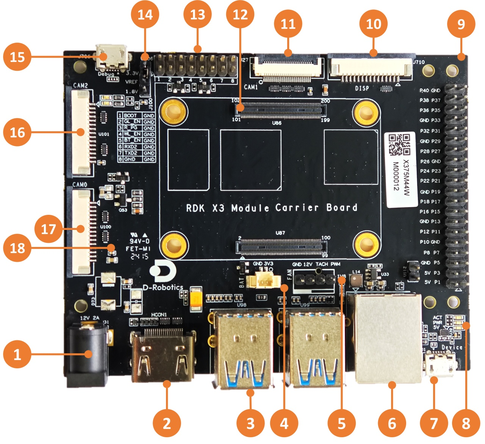
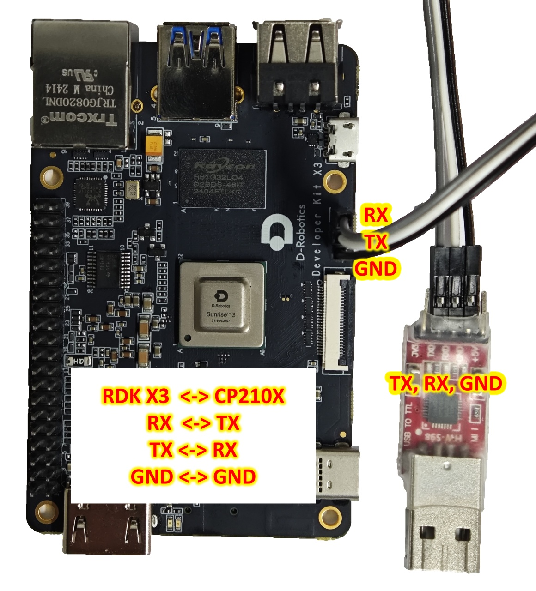
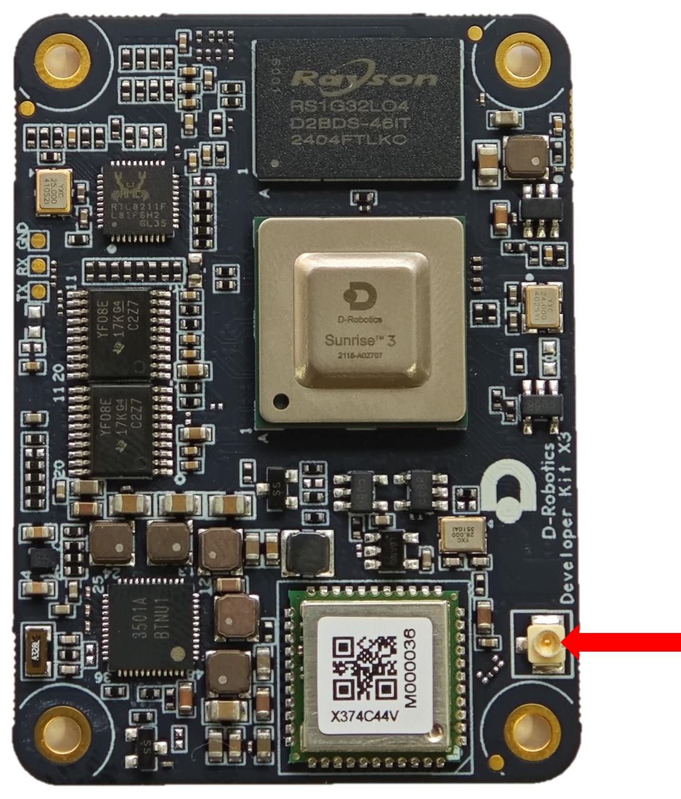
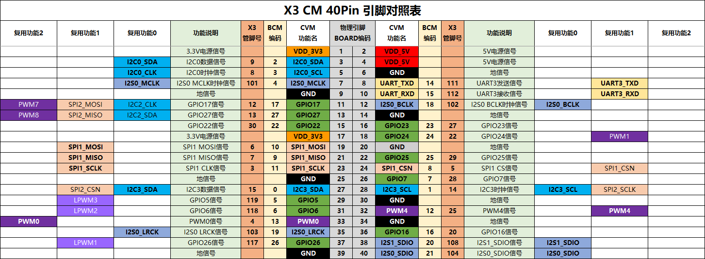
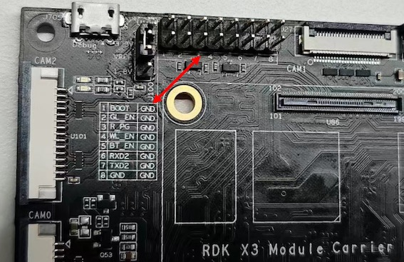

# 1.1.1 RDK X3

```mdx-code-block
import Tabs from '@theme/Tabs';
import TabItem from '@theme/TabItem';
```

## 接口总览

<Tabs groupId="rdk-type">
<TabItem value="x3" label="RDK X3">

RDK X3提供了网口、USB、摄像头、LCD、HDMI、40PIN等功能接口，方便用户进行图像多媒体、深度学习算法等应用的开发和测试。开发板接口布局如下：





| 序号 | 功能 | 序号 | 功能 | 序号 | 功能 |
| -------- | ---------------------------- | -------- | ----------------------- | ----------------------- | ----------------------- |
| 1 | USB Type C 供电接口 | 2 | MIPI CSI 摄像头接口 | 3 | 调试串口 |
| 4 | Micro USB 2.0 接口 | 5 | USB 2.0 Type A接口两路 | 6 | USB 3.0 Type A接口 |
| 7 | 千兆以太网口 | 8 | 40PIN接口 | 9 | HDMI接口 |
| 10 | 电源和状态LED指示灯 | 11 | Wi-Fi天线接口 | 12 | TF卡接口（底面） |

</TabItem>

<TabItem value="x3md" label="RDK X3 Module">

RDK X3 Module官方载板提供了以太网口、USB、HDMI、MIPI CSI、MIPI DSI、40PIN等多种外围接口，方便用户对RDK X3 Module进行功能验证、开发测试等工作。接口布局如下：

 

| 序号 | 接口功能        | 序号 | 接口功能                | 序号 | 接口功能               |
| ---- | --------------- | ---- | ----------------------- | ---- | ---------------------- |
| 1    | 电源接口        | 7    | Micro USB2.0 Device接口 | 13   | 功能控制IO header      |
| 2    | HDMI接口        | 8    | 工作指示灯              | 14   | IO电平选择header       |
| 3    | USB3.0 Host接口 | 9    | 40pin header            | 15   | debug口，USB转串口     |
| 4    | RTC电池接口     | 10   | MIPI DSI接口            | 16   | CAM2接口，2lane        |
| 5    | 风扇接口        | 11   | CAM1接口，4lane         | 17   | CAM0接口，2lane        |
| 6    | 千兆以太网口    | 12   | 核心模组接口            | 18   | Micro SD卡接口（背面） |

</TabItem>


</Tabs>


## 核心模组接口

<Tabs groupId="rdk-type">
<TabItem value="x3" label="RDK X3">

全板载设计， 无核心模组。

</TabItem>

<TabItem value="x3md" label="RDK X3 Module">

RDK X3 Module载板提供一组200pin板板连接器，用于核心模组的安装。安装时需要首先确认正确的方向和定位，避免对核心模组、载板的连接器造成损伤。

 

模组安装方法如下：

1. 对照核心模组上主芯片、DDR、Wi-Fi模组与载板三个丝印的左右顺序，确认安装方向正确。
2. 将核心模组放于载板正上方，并确认周围四个定位孔位置对齐。
3. 从核心模组中心向下按压，当模组发出咔哒的声响后，表示安装到位。

</TabItem>


</Tabs>


## 电源接口

<Tabs groupId="rdk-type">
<TabItem value="x3" label="RDK X3">

开发板提供一路USB Type C接口(接口1)，作为供电接口，需要使用支持**5V/3A**的电源适配器为开发板供电。将电源适配器接入开发板后，**开发板<font color='Red'>红色</font>电源指示灯亮起**，说明开发板供电正常。

</TabItem>

<TabItem value="x3md" label="RDK X3 Module">

RDK X3 Module载板通过DC接口供电，推荐使用认证配件清单中推荐的**12V/2A**适配器。接入电源后，如<font color='Red'>红色</font>电源指示灯正常点亮（接口8），说明设备供电正常。

</TabItem>

</Tabs>


:::caution

请不要使用电脑USB接口为开发板供电，否则会因供电不足造成开发板**异常断电、反复重启**等情况。

:::


## 调试串口{#debug_uart}

<Tabs groupId="rdk-type">
<TabItem value="x3" label="RDK X3">

开发板提供一路调试串口(接口3)，以实现串口登录、调试功能。电脑串口工具的参数配置如下：

- 波特率（Baud rate）：921600
- 数据位（Data bits）：8
- 奇偶校验（Parity）：None
- 停止位（Stop bits）：1
- 流控（Flow Control）：无

串口连接时，需要将杜邦线接入开发板接口3，串口USB转接板接入电脑。连接完成后如下图：  


</TabItem>

<TabItem value="x3md" label="RDK X3 Module">

RDK X3 Module载板提供一路调试（接口15），硬件上通过`CH340`芯片将核心模组调试串口转换为USB接口，用户可使用该接口进行各种调试工作。电脑串口工具的参数需按如下方式配置：

- 波特率（Baud rate）：921600
- 数据位（Data bits）：8
- 奇偶校验（Parity）：None
- 停止位（Stop bits）：1
- 流控（Flow Control）：无

通常情况下，用户第一次使用该接口时需要在电脑上安装CH340驱动，用户可搜索`CH340串口驱动`关键字进行下载、安装。

</TabItem>


</Tabs>


## 有线网口

<Tabs groupId="rdk-type">
<TabItem value="x3" label="RDK X3">

开发板提供一路千兆以太网接口(接口7)，支持1000BASE-T、100BASE-T标准，默认采用静态IP模式，IP地址`192.168.1.10`, 3.0.0及以后系统的默认IP调整为`192.168.127.10` 。如需确认开发板IP地址，可通过串口登录设备，并用`ifconfig`命令进行查看 `eth0`网口的配置.

</TabItem>

<TabItem value="x3md" label="RDK X3 Module">

开发板提供一路千兆以太网接口(接口6)，支持1000BASE-T、100BASE-T标准，默认采用静态IP模式，IP地址`192.168.1.10`， 3.0.0及以后系统的默认IP调整为`192.168.127.10` 。如需确认开发板IP地址，可通过串口登录设备，并用`ifconfig`命令进行查看 `eth0`网口的配置。


</TabItem>


</Tabs>


## HDMI接口{#hdmi_interface}

<Tabs groupId="rdk-type">
<TabItem value="x3" label="RDK X3">

开发板提供一路HDMI(接口9)显示接口，最高支持1080P分辨率。开发板通过HDMI接口在显示器输出Ubuntu系统桌面(Ubuntu Server版本显示logo图标)。此外，HDMI接口还支持实时显示摄像头、网络流画面功能。

目前HDMI接口支持的显示分辨率如下：

- 1920x1080
- 1280x720
- 1024x600
- 800x480

</TabItem>

<TabItem value="x3md" label="RDK X3 Module">

RDK X3 Module载板提供一路HDMI显示接口（接口2），最高支持1080P分辨率。开发板通过HDMI接口在显示器输出Ubuntu系统桌面(Ubuntu Server版本显示logo图标)。此外，HDMI接口还支持实时显示摄像头、网络流画面功能。

目前HDMI接口支持的显示分辨率如下：

- 1920x1080
- 1280x720
- 1024x600
- 800x480

</TabItem>


</Tabs>

## USB接口

<Tabs groupId="rdk-type">
<TabItem value="x3" label="RDK X3">

由于X3芯片只提供一路USB接口，开发板通过硬件电路实现了多路USB接口扩展，满足用户对多路USB设备接入的需求，接口描述如下：

| 接口类型       | 接口序号 | 接口数量 | 接口描述                                                 |
| -------------- | -------- | -------- | -------------------------------------------------------- |
| Micro USB 2.0  | 接口4    | 1路      | USB Device模式，用于连接主机实现ADB、Fastboot、UVC等功能 |
| USB 2.0 Type A | 接口5    | 2路      | USB Host模式，用于接入USB 2.0外设                        |
| USB 3.0 Type A | 接口6    | 1路      | USB Host模式，用于接入USB 3.0外设                        |

USB主从模式切换完全由硬件电路实现，用户只需按照上表的逻辑连接设备即可。

开发板USB Host、Device功能互斥，Device接口接入设备后，Host接口会自动失效。

### 接入U盘

Video: https://www.bilibili.com/video/BV1rm4y1E73q/?p=5

开发板USB Type A接口(接口5和6)，支持U盘功能，可自动检测U盘接入并挂载，默认挂载目录为`/media/sda1`。

### 接入USB串口转接板

开发板USB Type A接口(接口5和6)，支持USB串口转接板功能，可自动检测USB串口转接板接入并创建设备节点`/dev/ttyUSB*` 或者 `/dev/ttyACM*`（星号代表0开始的数字）。用户可参考 [使用串口](../03_Basic_Application/03_40pin_user_guide/uart.md#40pin_uart_usage) 章节对串口进行使用。

</TabItem>

<TabItem value="x3md" label="RDK X3 Module">

RDK X3核心模组只支持一路USB3.0接口，因此载板通过外围电路及USB HUB扩展，实现了4路USB3.0 Host接口和1路Micro USB2.0 Device接口，满足用户对USB接口的多样需求，接口描述如下：

| 接口类型            | 接口序号 | 接口数量 | 接口描述                  |
| ------------------- | -------- | -------- | ------------------------- |
| USB3.0 Type A Host  | 接口3    | 4路      | 用于USB外设接入           |
| Micro USB2.0 Device | 接口7    | 1路      | 用于adb调试、fastboot烧录 |

:::caution 注意
USB主从模式切换完全由硬件电路实现，用户只需按照上表的逻辑连接设备即可。

开发板USB Host、Device功能互斥，Device接口接入设备后，Host接口会自动失效。
:::

</TabItem>


</Tabs>


## USB摄像头

Video: https://www.bilibili.com/video/BV1rm4y1E73q/?p=6

开发板USB Type A接口，支持USB摄像头功能，可自动检测USB摄像头接入并创建设备节点`/dev/video8`。


## MIPI CSI{#mipi_port}

<Tabs groupId="rdk-type">
<TabItem value="x3" label="RDK X3">
Video: https://www.bilibili.com/video/BV1rm4y1E73q/?p=7

开发板提供1路MIPI CSI接口(接口2)，可实现MIPI摄像头的接入。目前开发板适配了多种规格的摄像头模组，模组型号、规格如下：

| 序号 | Sensor |   分辨率  |  FOV  | I2C 设备地址 |
| --- | ------ | ------- | ------- | ------- |
|  1  | GC4663 | 400W | H:104 V:70 D:113 | 0x29 |
|  2  | JXF37  | 200W | H:62  V:37 D:68   | 0x40 |
|  3  | IMX219  | 800W | H:62  V:37 D:68   | 0x10 |
|  4  | IMX477  | 1200W | H:62  V:37 D:68   | 0x1a |
|  5  | OV5647  | 500W | H:62  V:37 D:68   | 0x36 |

摄像头模组通过FPC排线跟开发板连接，注意排线两端蓝面向上插入连接器。

以JXF37摄像头模组为例，安装完成后如下图：  


安装完成后，用户可以通过i2cdetect命令确认模组I2C地址能否正常检测到。

首先，确认当前板卡的id号
```shell
cat /sys/class/socinfo/som_name
```

然后根据id号在`/etc/board_config.json`中找到对应的i2c和reset gpio
```shell
cat /etc/board_config.json
```

X3 PI V2.1的id是8，i2c接口是1，reset gpio是19
```shell
"board_8": {
    "board_id": "8",
    "camera_num": 2,
    "cameras": [
      {
        "reset": "19:low",
        "i2c_bus": 1,
        "mipi_host": 0
      },
      {
        "reset": "19:low",
        "i2c_bus": 1,
        "mipi_host": 2
      }
    ]
  },
```

查询sensor的指令就是
```shell
echo 19 > /sys/class/gpio/export
echo out > /sys/class/gpio/gpio19/direction
echo 0 > /sys/class/gpio/gpio19/value
sleep 0.1
echo 1 > /sys/class/gpio/gpio19/value

i2cdetect -y -r 1
```

</TabItem>

<TabItem value="x3md" label="RDK X3 Module">

RDK X3 Module载板提供CAM 0/1/2三组MIPI CSI接口，可以满足3路Camera模组的同时接入，满足不同用户的使用需求，具体说明如下：

1. CAM 0/2（接口16/17），采用15pin FPC连接器，可直接接入树莓派OV5647、IMX219、IMX477等多种Camera模组。
2. CAM 1（接口11），采用24pin FPC连接器，支持F37、GC4663、IMX415等多种Camera模组。

摄像头模组的基础规格如下：

| 序号 | Sensor | 分辨率 | FOV              | I2C 设备地址 |
| ---- | ------ | ------ | ---------------- | ------------ |
| 1    | GC4663 | 400W   | H:104 V:70 D:113 | 0x29         |
| 2    | JXF37  | 200W   | H:62  V:37 D:68  | 0x40         |
| 3    | IMX219 | 800W   | H:62  V:37 D:68  | 0x10         |
| 4    | IMX477 | 1200W  | H:62  V:37 D:68  | 0x1a         |
| 5    | OV5647 | 500W   | H:62  V:37 D:68  | 0x36         |

上述Camera模组的购买方式可参考[购买链接](../07_Advanced_development/01_hardware_development/rdk_x3/accessory.md)。

安装完成后，用户可以通过i2cdetect命令确认模组I2C地址能否正常检测到。

首先，确认当前板卡的id号
```shell
cat /sys/class/socinfo/som_name
```

然后根据id号在`/etc/board_config.json`中找到对应的i2c和reset gpio
```shell
cat /etc/board_config.json
```

X3 CM的id是b，sensor接口有三个，分别是i2c3，reset 114， i2c1，reset 115，i2c0，reset 116。
```shell
"board_b": {
    "board_id": "b",
    "camera_num": 3,
    "cameras": [
      {
        "reset": "114:low",
        "i2c_bus": 3,
        "mipi_host": 0
      },
      {
        "reset": "114:low",
        "i2c_bus": 1,
        "mipi_host": 1
      },
      {
        "reset": "114:low",
        "i2c_bus": 0,
        "mipi_host": 2
      }
    ]
  }
```

查询mipi_host 0 的指令就是
```shell
echo 114 > /sys/class/gpio/export
echo out > /sys/class/gpio/gpio114/direction
echo 0 > /sys/class/gpio/gpio114/value
sleep 0.1
echo 1 > /sys/class/gpio/gpio114/value

i2cdetect -y -r 3
```

</TabItem>


</Tabs>

:::caution
重要提示：严禁在开发板未断电的情况下插拔摄像头，否则非常容易烧坏摄像头模组。
:::

## MIPI DSI接口

<Tabs groupId="rdk-type">
<TabItem value="x3" label="RDK X3">

无该接口。

</TabItem>

<TabItem value="x3md" label="RDK X3 Module">

RDK X3 Module载板提供一路MIPI DSI接口（接口10），可以用于LCD显示屏等接入。接口采用15pin FPC连接器，可直接接入树莓派多款LCD显示屏。

对于MIPI DSI接口的详细使用方法，可参考[MIPI DSI显示屏使用](/hardware_development/rdk_x3_module/display)。

</TabItem>

<TabItem value="ulrta" label="RDK Ultra">

无该接口。

</TabItem>

</Tabs>

## Micro SD接口

<Tabs groupId="rdk-type">
<TabItem value="x3" label="RDK X3">

开发板提供1路Micro SD存储卡接口(接口12)。推荐使用至少8GB容量的存储卡，以便满足Ubuntu操作系统及相关功能包的安装要求。

</TabItem>

<TabItem value="x3md" label="RDK X3 Module">

RDK X3 Module载板提供一路Micro SD存储卡接口（接口18）。推荐使用至少8GB容量的存储卡，以便满足Ubuntu操作系统及相关功能包的安装要求。

</TabItem>


</Tabs>

:::caution

开发板使用中禁止热插拔TF存储卡，否则会造成系统运行异常，甚至造成存储卡文件系统损坏。

:::

## Wi-Fi天线接口

<Tabs groupId="rdk-type">
<TabItem value="x3" label="RDK X3">

Video: https://www.bilibili.com/video/BV1rm4y1E73q/?p=8

开发板的无线网络支持板载和外置天线两种配置，通常情况下板载天线可以满足使用需求。当开发板安装金属材质外壳后，需要连接外置天线到（接口11），以增强信号强度。

:::tip 
通过以下命令可以将板载天线转化为外置天线 sed -i 's/trace/cable/g' /etc/init.d/hobot-wifi ，重启后生效。
使用以下命令 sed -i 's/cable/trace/g' /etc/init.d/hobot-wifi 重启后进行复原。
:::

</TabItem>

<TabItem value="x3md" label="RDK X3 Module">

RDK X3 Module无板载天线，通常情况下需要连接外置天线，以增强信号强度。



</TabItem>

<TabItem value="ulrta" label="RDK Ultra">

开发板出厂已安装好无线网卡模块及天线（接口15）。

</TabItem>

</Tabs>

## 40pin header接口

<Tabs groupId="rdk-type">
<TabItem value="x3" label="RDK X3">

RDK X3开发板提供40pin header接口，IO信号采用3.3V电平设计。管脚定义兼容树莓派等产品，详细管脚定义、复用关系如下：


RDK X3 2.0 & Module 外扩40PIN管脚及其定义如下：


开发板40PIN接口位置提供了丝印网表，方便用户对照操作，PIN1、PIN40位置如下：


40PIN各功能的使用方法请查看 [40PIN 功能使用](../03_Basic_Application/03_40pin_user_guide/40pin_define.md) 章节。

</TabItem>

<TabItem value="x3md" label="RDK X3 Module">

RDK X3 Module载板提供一组40pin header接口（接口9），接口信号电平由IO电平切换header指定（接口14），支持1.8V、3.3V两种模式。管脚定义兼容树莓派等产品，详细管脚定义、复用关系如下：



:::caution 注意
默认情况下，RDK X3 Module核心模组固件、载板电平配置为3.3V，如需要切换IO电平时，请参考[IO电平选择header接口](#io电平切换接口)。
:::

</TabItem>

</Tabs>


## 功能控制接口

<Tabs groupId="rdk-type">
<TabItem value="x3" label="RDK X3">

无该接口。

</TabItem>

<TabItem value="x3md" label="RDK X3 Module">

RDK X3 Module载板提供一组控制IO接口（接口13），用户使用跳线帽短接相应管脚，可实现对核心模组多种功能模式的控制，管脚功能定义如下：

| 管脚号 | 管脚名称 | 功能描述                       | 使用方式                            |
| ------ | -------- | ------------------------------ | ----------------------------------- |
| 1      | BOOT     | 用于控制fastboot烧录模式的进入 | 跳线帽接地后，重新上电              |
| 2      | GL_EN    | 用于关闭核心板输入电源         | 跳线帽接地后，核心板断电            |
| 3      | R_PG     | 用于指示核心板工作状态         | 高电平代表核心板工作正常            |
| 4      | W_EN     | 用于关闭Wi-Fi功能              | 跳线帽接地后Wi-Fi关闭，重启系统恢复 |
| 5      | BT_EN    | 用于关闭蓝牙功能               | 跳线帽接地后蓝牙关闭，重启系统恢复  |
| 6      | RXD2     | 串口UART2接收信号              | 串口UART2接收信号                   |
| 7      | TXD2     | 串口UART2发送信号              | 串口UART2接收信号                   |
| 8      | GND      | GDN                            | GND                                 |

此外，为方便用户查询，上述管脚定义在载板丝印也有体现。  

  

</TabItem>


</Tabs>


## IO电平切换接口

<Tabs groupId="rdk-type">
<TabItem value="x3" label="RDK X3">

无该接口。

</TabItem>

<TabItem value="x3md" label="RDK X3 Module">

RDK X3 Module载板提供IO电平切换功能，用于控制40pin header电平模式，支持1.8V、3.3V两种电平。。

接口信号从上往下分别为3.3V、VREF、1.8V，具体如下图：


需要说明的是，**该接口不能悬空，否则核心模组会因供电异常无法开机**。

:::caution 当需要切换电平时，请严格按照下述步骤进行。
默认情况下，RDK X3 Module核心模组固件、载板电平配置为3.3V，如需要切换IO电平时，需要按如下步骤进行：

1. 下载支持1.8V电平配置的启动固件，[固件下载地址](https://archive.d-robotics.cc/downloads/miniboot)。
2. 使用官方烧录工具`hbupdate`，更新核心板启动固件，具体方法请参考[镜像烧录](../01_Quick_start/install_os.md)。
3. 设备断电，使用跳线帽将`vref`、`1.8V`信号短接后重新上电。
:::

</TabItem>


</Tabs>