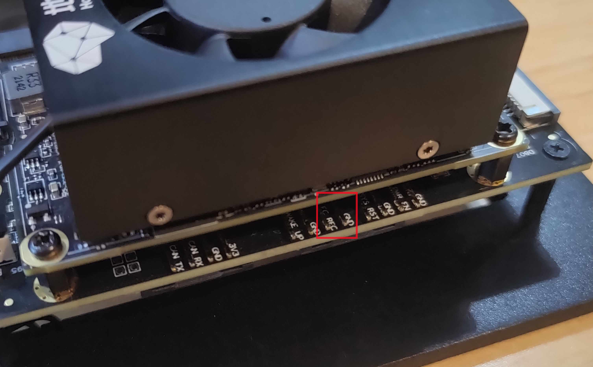
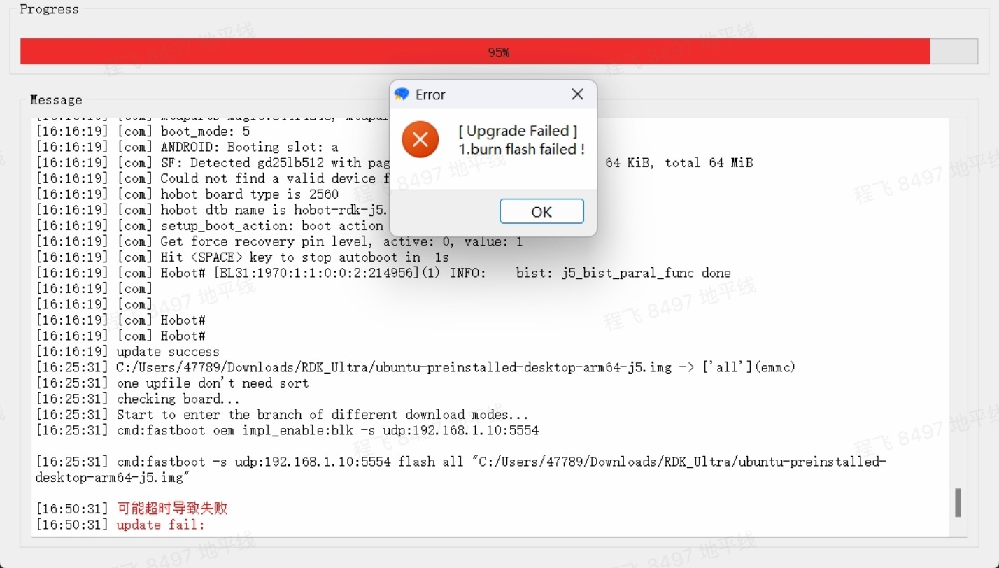

# RDK ultra

## 烧录准备

### **供电**

RDK Ultra开发板通过DC接口供电，推荐使用`官方套件`中自带的电源适配器，或者使用至少**12V/5A**的电源适配器供电。

:::caution

请不要使用电脑USB接口为开发板供电，否则会因供电不足造成开发板**异常断电、反复重启**等异常情况。

更多问题的处理，可以查阅 [常见问题](../../08_FAQ/01_hardware_and_system.md) 章节。

:::

### **存储** 

RDK Ultra板载64GB eMMC存储空间，不需要额外准备存储卡。

### **显示** 

RDK Ultra开发板支持HDMI显示接口，通过HDMI线缆连接开发板和显示器，支持图形化桌面显示。

### **网络连接**

RDK Ultra开发板支持以太网、Wi-Fi两种网络接口，用户可通过任意接口实现网络连接功能。

## 系统烧录

RDK Ultra 目前提供Ubuntu 20.04系统镜像，可支持Desktop桌面图形化交互。

:::info 注意

**RDK Ultra**出厂已经烧写测试版本系统镜像，为确保使用最新版本的系统，建议参考本文档完成最新版本系统镜像的烧写。
:::

### 镜像下载 {#img_download}

点击 [**下载镜像**](https://archive.d-robotics.cc/downloads/os_images)，选择rdk_ultra目录，选择对应版本，进入文件下载页。以下载1.0.0版本的系统镜像为例：

下载完成后，解压出Ubuntu系统镜像文件，如`ubuntu-preinstalled-desktop-arm64-rdkultra.img`

:::tip

- desktop：带有桌面的Ubuntu系统，可以外接屏幕、鼠标操作
- server：无桌面的Ubuntu系统，可以通过串口、网络远程连接操作
:::

### 系统烧录

RDK Ultra开发套件烧录Ubuntu系统时，需要使用D-Robotics `hbupdate`烧录工具。目前工具支持Windows、Linux两种版本，分别以 `hbupdate_win64`、 `hbupdate_linux` 开头，工具下载链接：[hbupdate](https://archive.d-robotics.cc/downloads/hbupdate/)。

:::tip 注意事项

  - 解压工具压缩包，注意解压路径中不要包含**空格、中文、特殊字符**等内容。
  - 工具通过网口跟RDK Ultra通讯，为保证烧录速度，请确保**PC支持千兆网口，并采用直连方式**。
  - PC端网络需要提前配置为**静态IP方式**，具体如下：
    - IP：192.168.1.195
    - netmask：255.255.255.0
    - gateway：192.168.1.1
:::

1. 通过网线将RDK Ultra和PC机直连，并确保网络可以ping通。

2. 将功能控制接口（接口10）的`FC_REC`和`GND`信号短接。

3. 运行`hbupdate`主程序，打开下载工具并选择开发板型号为`RDK_ULTRA`，必选项。

4. 点击`Browse`按钮选择将要烧录的镜像文件，必选项。

5. 点击`Start`按钮开始刷机，根据提示信息确认操作无误后，点击`OK`按钮：

6. 当工具显示如下打印时，说明进入烧写过程，该过程耗时依赖于网络传输速度，请耐心等待。

7. 等待工具烧录完成，并检查烧录结果：

- 镜像烧录成功时，工具提示如下：

- 工具提示如下错误时，请确认步骤1~3是否操作正确。

- 工具提示如下错误时，说明网络传输速度过慢，建议更换性能更好的PC后重新升级。
  

:::caution

如烧录过程发生中断，请按照上述步骤重新进行。
:::

### 启动系统

首先保持开发板断电，去除功能控制接口（接口10）的FC_REC和GND信号短接线，通过HDMI线缆连接开发板与显示器，最后给开发板上电。

系统首次启动时会进行默认环境配置，整个过程持续45秒左右，配置结束后会在显示器输出Ubuntu系统桌面。

Ubuntu Desktop版本系统启动完成后，会通过HDMI接口在显示器上输出系统桌面，如下图：

## **常见问题**  

### **注意事项**

- 禁止带电时拔插除USB、HDMI、网线之外的任何设备

:::tip

更多问题的处理，可以查阅 [常见问题](../../08_FAQ/01_hardware_and_system.md) 章节，同时可以访问 [D-Robotics 开发者官方论坛](https://developer.d-robotics.cc/forum) 获得帮助。

:::