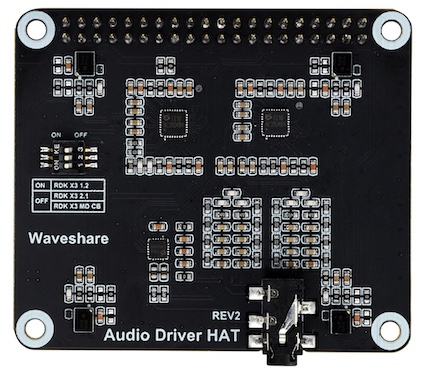

# 3.2.3 RDK X5 系列音频使用指南

RDK X5 集成了ES8236，用户还可以对接种音频板来扩展音频功能，满足不同语音场景的功能需，下面将对板载音频codec 和 音频板的使用方法进行详细介绍。

:::note 提示

如果安装驱动后提示Miniboot版本不是最新，请进入`1 System Options` -> `S7 Update Miniboot` 更新miniboot

:::


## 板载ES8326

## Audio Driver HAT REV2

### 产品简介

Audio Driver HAT REV2是由微雪电子生产的一款音频转接板，采用ES7210+ES8156双Codec方案，可实现环形4MIC录音、双通道音频播放、音频信号回采功能，转接板外观如下图：



关于音频转接板的详细介绍，请参考[Audio Driver HAT](https://www.waveshare.net/shop/Audio-Driver-HAT.htm)。

### 安装方法

1. 按照下图方式，将转接板接入RDK X5 的40pin header  
  
并将拨码开关全部拨到**off**


2. 使用`srpi-config`配置音频板  
进入`3 Interface Options`->`I5 Audio`  
选择`Audio Driver HAT V2`：
  


3. 运行命令`sync && reboot`重启开发板，如`/dev/snd`下出现如下设备节点，说明转接板安装成功
    ```shell
    root@ubuntu:/userdata# ls /dev/snd
    by-path  controlC0  controlC1  pcmC0D0c  pcmC0D0p  pcmC1D0c  pcmC1D1p  timer
    ```
    其中，pcmC0D0c  pcmC0D0p是板载音频codec ES8236注册的音频设备，pcmC1D0c  pcmC1D1p是ES7210+ES8156注册的音频设备


### 卸载方法
1. 使用`srpi-config`配置音频板   
进入`3 Interface Options`->`I5 Audio`  
选择`UNSET`,即可卸载音频驱动和相关配置

### 音频节点
该音频板在`RDK X5`上的的播放节点为`pcmC1D1p`，录制节点为`pcmC1D0c`

### 录音播放测试

测试使用`tinyalsa`库的工具集：使用`tinycap`进行录制，使用`tinyplay`进行播放

`tinycap`使用说明：
```shell
tinycap
Usage: tinycap {file.wav | --} [-D card] [-d device] [-c channels] [-r rate] [-b bits] [-p period_size] [-n n_periods] [-t time_in_seconds]

Use -- for filename to send raw PCM to stdout
```
`tinyplay`使用说明：
```shell
tinyplay
usage: tinyplay file.wav [options]
options:
-D | --card   <card number>    The device to receive the audio
-d | --device <device number>  The card to receive the audio
-p | --period-size <size>      The size of the PCM's period
-n | --period-count <count>    The number of PCM periods
-i | --file-type <file-type >  The type of file to read (raw or wav)
-c | --channels <count>        The amount of channels per frame
-r | --rate <rate>             The amount of frames per second
-b | --bits <bit-count>        The number of bits in one sample
-M | --mmap                    Use memory mapped IO to play audio
```
如果想了解更多关于`tinyalsa`库的信息，请查阅它们的[仓库地址](https://github.com/tinyalsa/tinyalsa)

- 2通道麦克风录音：

```
tinycap ./2chn_test.wav -D 1 -d 0 -c 2 -b 16 -r 48000 -p 512 -n 4 -t 5
```

- 4通道麦克风录音：

```
tinycap ./4chn_test.wav -D 1 -d 0 -c 4 -b 16 -r 48000 -p 512 -n 4 -t 5
```

- 双通道音频播放（不支持直接播放4通道录音）：

```
tinyplay ./2chn_test.wav -D 1 -d 1
```