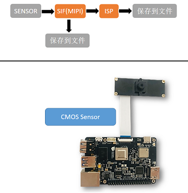
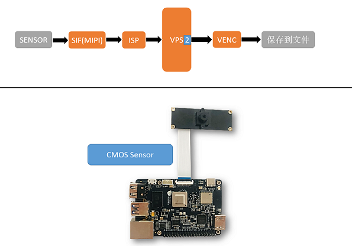
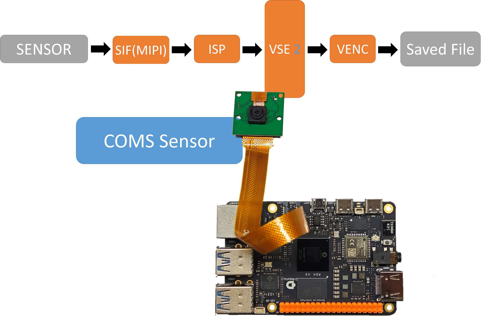
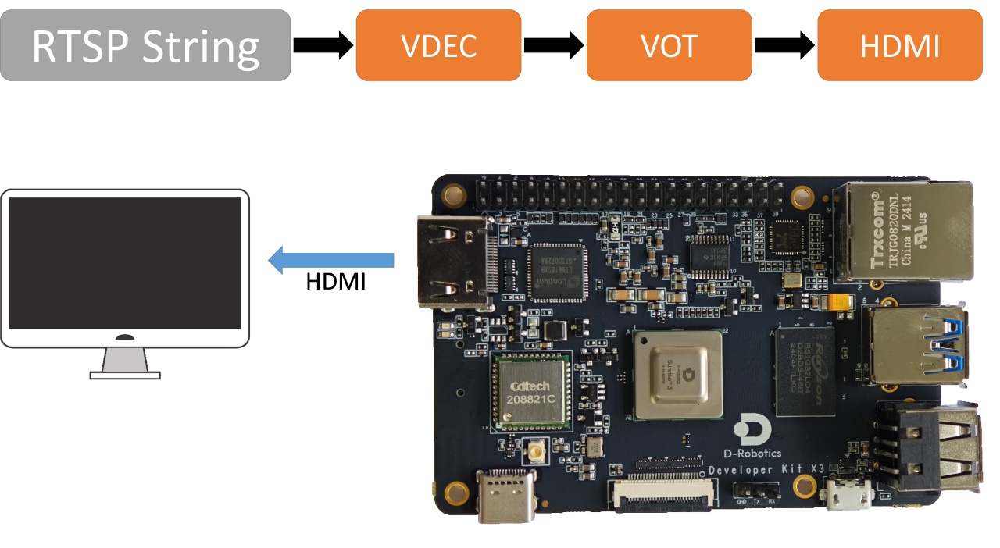

# 3.4.2 参考示例（C++）

本章节介绍多媒体库开发的多种功能示例，包括摄像头图像采集、视频编解码、视频显示、算法推理等功能。

## 摄像头图像采集和显示

本示例`vio2display`示例实现了`MIPI`摄像头图像采集功能，并通过`HDMI`接口输出，用户可通过显示器预览画面。

示例流程框图如下：


 - **环境准备：**
   - 开发板断电状态下，将`MIPI`摄像头接入开发板，连接方法可参考-[硬件简介-MIPI接口](https://developer.d-robotics.cc/rdk_doc/Quick_start/hardware_introduction/rdk_x3#mipi_port)
   - 通过HDMI线缆连接开发板和显示器
   - 开发板上电，并通过命令行登录

 - **运行方式：**
    示例代码以源码形式提供，需要使用`make`命令进行编译后运行，步骤如下：
    ```bash
    sunrise@ubuntu:~$ cd /app/cdev_demo/vio2display
    sunrise@ubuntu:/app/cdev_demo/vio2display$ sudo make
    sunrise@ubuntu:/app/cdev_demo/vio2display$ sudo ./vio2display -w 1920 -h 1080
    ```
   参数说明：
    - -w: sensor输出宽度
    - -h: sensor输出高度

 - **预期效果：**
    程序正确运行后，开发板会通过显示器输出`MIPI`摄像头采集的实时画面。运行log如下：
    ```bash
      sunrise@ubuntu:/tmp/nfs/sp_cdev/cdev_demo/vio2display$ ./vio2display -w 1920 -h 1080
      disp_w=1920, disp_h=1080
      2023/03/28 02:08:03.359 !INFO [x3_cam_init_param][0099]Enable mipi host0 mclk
      2023/03/28 02:08:03.359 !INFO [x3_cam_init_param][0099]Enable mipi host1 mclk
      Camera: gpio_num=114, active=low, i2c_bus=3, mipi_host=0
      Camera: gpio_num=114, active=low, i2c_bus=1, mipi_host=1
      Camera: gpio_num=114, active=low, i2c_bus=0, mipi_host=2
      Camera 0:
            enable: 1
            i2c_bus: 3
            mipi_host: 0
      Camera 1:
            enable: 1
            i2c_bus: 1
            mipi_host: 1
      Camera 2:
            enable: 1
            i2c_bus: 0
            mipi_host: 2
      cmd=i2ctransfer -y -f 3 w2@0x10 0x0 0x0 r1 2>&1, result=0x02

      Found sensor:imx219 on i2c bus 3, use mipi host 0
      Setting VPS channel-2: src_w:1920, src_h:1080; dst_w:1920, dst_h:1080;
      Setting VPS channel-1: src_w:1920, src_h:1080; dst_w:1920, dst_h:1080;
      sp_open_camera success!
      libiar: hb_disp_set_timing done!

      Press 'q' to Exit !
    ```

## 摄像头图像本地保存 (RDK X3)

本示例`vio_capture`示例实现了`MIPI`摄像头图像采集，并将`RAW`和`YUV`两种格式的图像本地保存的功能。示例流程框图如下：


 - **环境准备：**
   - 开发板断电状态下，将`MIPI`摄像头接入开发板，连接方法可参考-[硬件简介-MIPI接口](https://developer.d-robotics.cc/rdk_doc/Quick_start/hardware_introduction/rdk_x3#mipi_port)
   - 通过HDMI线缆连接开发板和显示器
   - 开发板上电，并通过命令行登录

 - **运行方式：**
    示例代码以源码形式提供，需要使用`make`命令进行编译后运行，步骤如下：
    ```bash
    sunrise@ubuntu:~$ cd /app/cdev_demo/vio_capture/
    sunrise@ubuntu:/app/cdev_demo/vio_capture$ sudo make
    sunrise@ubuntu:/app/cdev_demo/vio_capture$ sudo ./capture -b 12 -c 10 -h 1080 -w 1920
    ```
    参数说明：
    - -b: RAW图bit数，IMX477：12，others：10
    - -c: 保存图像的数量
    - -w: 保存图像的宽度
    - -h: 保存图像的高度


 - **预期效果：**
    程序正确运行后，当前目录保存指定数量的图片文件，`RAW`格式以`raw_*.raw`方式命名，`YUV`格式以`yuv_*.yuv`方式命名。运行log如下：
    ```bash
    sunrise@ubuntu:/app/cdev_demo/vio_capture$ sudo ./capture -b 12 -c 10 -h 1080 -w 1920
    Setting VPS channel-2: src_w:1920, src_h:1080; dst_w:1920, dst_h:1080;
    Setting VPS channel-1: src_w:1920, src_h:1080; dst_w:1920, dst_h:1080;
    jiale:start streaming...
    capture time :0
    capture time :1
    capture time :2
    capture time :3
    capture time :4
    capture time :5
    capture time :6
    capture time :7
    capture time :8
    capture time :9
    sensor_name imx477, setting_size = 1
    [  701.213210]hb_isp_algo_stop@main_user.c:389 GENERIC(ERR) :g_mutex destroy.
    ```

## 摄像头图像本地保存 (RDK X5)

本示例`vio_capture`示例实现了`MIPI`摄像头图像采集，并将`RAW`和`YUV`两种格式的图像本地保存的功能。示例流程框图如下：


 - **环境准备：**

   - 开发板断电状态下，将 `MIPI` 摄像头接入开发板，连接方法可参考 -[硬件简介-MIPI接口](https://developer.d-robotics.cc/rdk_doc/Quick_start/hardware_introduction/rdk_x3#mipi_port)
   - 通过 HDMI 线缆连接开发板和显示器
   - 开发板上电，并通过命令行登录

 - **运行方式：**
   示例代码以源码形式提供，需要使用`make`命令进行编译后运行，步骤如下：

   ```bash
   sunrise@ubuntu:~$ cd /app/cdev_demo/vio_capture/
   sunrise@ubuntu:/app/cdev_demo/vio_capture$ sudo make
   sunrise@ubuntu:/app/cdev_demo/vio_capture$ sudo ./capture -b 16 -c 10 -h 1080 -w 1920
   ```

   参数说明：

   - -b:  RAW图bit数，IMX219 / IMX477 / OV5647 都设置为 16，只有极少数 Camera Sensor 需要设置为 8
   - -c: 保存图像的数量
   - -w: 保存图像的宽度
   - -h: 保存图像的高度


 - **预期效果：**
   程序正确运行后，当前目录保存指定数量的图片文件，`RAW`格式以`raw_*.raw`方式命名，`YUV`格式以`yuv_*.yuv`方式命名。运行log如下：

   ```bash
   sunrise@ubuntu:/app/cdev_demo/vio_capture$ sudo ./capture -b 16 -c 10 -h 1080 -w 1920
   [INFO] board_id is 301, not need skip sci1.
   Searching camera sensor on device: /proc/device-tree/soc/cam/vcon@0 i2c bus: 6 mipi rx phy: 0
   INFO: Found sensor name:ov5647 on mipi rx csi 0, i2c addr 0x36, config_file:linear_1920x1080_raw10_30fps_2lane.c
   2000/01/01 08:18:54.877 !INFO [CamInitParam][0139]Setting VSE channel-0: input_width:1920, input_height:1080,  dst_w:1920, dst_h:1080
   2000/01/01 08:18:54.877 !INFO [CamInitParam][0139]Setting VSE channel-1: input_width:1920, input_height:1080, dst_w:1920, dst_h:1080
   ... 省略 ...
   capture time :0
   temp_ptr.data_size[0]:4147200
   capture time :1
   temp_ptr.data_size[0]:4147200
   capture time :2
   temp_ptr.data_size[0]:4147200
   ... 省略 ...
   capture time :8
   temp_ptr.data_size[0]:4147200
   capture time :9
   temp_ptr.data_size[0]:4147200
   ov5647 sensor stop
   ```

## 摄像头图像本地保存 (RDK Ultra)

本示例`vio_capture`示例实现了`MIPI`摄像头图像采集，并提供`RAW`和`YUV`两种格式的图像本地保存的功能（两者互斥）。示例流程框图如下：


 - **环境准备：**
   - 开发板断电状态下，将`MIPI`摄像头接入开发板，连接方法可参考-[硬件简介-MIPI接口](https://developer.d-robotics.cc/rdk_doc/Quick_start/hardware_introduction/rdk_x3#mipi_port)
   - 通过HDMI线缆连接开发板和显示器
   - 开发板上电，并通过命令行登录
   - **如果需要获取raw数据，请先按照以下步骤进行配置**：
      - 编辑摄像头对应的配置文件，以`IMX219`为例，编辑`/etc/camera_configs/Ultra/imx219/1080/vpm.json`
      - 将`isp_dma_output_format`字段修改成`4`，保存更改
   - **如果需要获取`NV12`格式的图片，请先按照以下步骤进行配置**：
      - 编辑摄像头对应的配置文件，以`IMX219`为例，编辑`/etc/camera_configs/Ultra/imx219/1080/vpm.json`
      - 将`isp_stream_output_format`字段修改为`0`；将`isp_dma_output_format`字段修改为`9`；将`pym_mode`字段修改为`0`；保存更改

 - **运行方式：**
    示例代码以源码形式提供，需要使用`make`命令进行编译后运行，步骤如下：
    ```bash
    sunrise@ubuntu:~$ cd /app/cdev_demo/vio_capture/
    sunrise@ubuntu:/app/cdev_demo/vio_capture$ sudo make
    sunrise@ubuntu:/app/cdev_demo/vio_capture$ sudo ./capture -b 12 -c 10 -h 1080 -w 1920 -m 0
    ```
    参数说明：
    - -b: RAW图bit数，目前都是**12**
    - -c: 保存图像的数量
    - -w: 保存图像的宽度
    - -h: 保存图像的高度
    - -m: 保存图像的类型，0:yuv，1:raw


 - **预期效果：**
    程序正确运行后，当前目录保存指定数量的图片文件，`RAW`格式以`raw_*.raw`方式命名，`YUV`格式以`yuv_*.yuv`方式命名。运行log如下：
    ```bash
    root@ubuntu:/app/cdev_demo/media_cdev/vio_capture# sudo ./capture -b 12 -c 10 -h 1080 -w 1920 -m 0
    Camera: gpio_num=432, active=low, i2c_bus=6, mipi_host=3
    Camera: gpio_num=293, active=low, i2c_bus=5, mipi_host=1
    Camera: gpio_num=290, active=low, i2c_bus=4, mipi_host=2
    Camera: gpio_num=289, active=low, i2c_bus=2, mipi_host=0
    cmd=i2ctransfer -y -f 6 w2@0x10 0x0 0x0 r1 2>&1, result=0x02
    capture time :0
    capture time :1
    capture time :2
    capture time :3
    capture time :4
    capture time :5
    capture time :6
    capture time :7
    capture time :8
    capture time :9
    sensor_name imx219, setting_size = 1
    ```

## 摄像头图像采集并编码

本示例`vio2encoder`示例实现了 `MIPI` 摄像头图像采集功能，并编码后在本地保存，用户可通过显示器预览画面。示例流程框图如下：


 - **环境准备：**
   - 开发板断电状态下，将`MIPI`摄像头接入开发板，连接方法可参考-[硬件简介-MIPI接口](https://developer.d-robotics.cc/rdk_doc/Quick_start/hardware_introduction/rdk_x3#mipi_port)
   - 通过HDMI线缆连接开发板和显示器
   - 开发板上电，并通过命令行登录

 - **运行方式：** 按照以下命令执行程序
    示例代码以源码形式提供，需要使用`make`命令进行编译后运行，步骤如下：
    ```bash
    sunrise@ubuntu:~$ cd /app/cdev_demo/vio2encoder
    sunrise@ubuntu:/app/cdev_demo/vio2encoder$ sudo make
    sunrise@ubuntu:/app/cdev_demo/vio2encoder$ sudo ./vio2encoder -w 1920 -h 1080 --iwidth 1920 --iheight 1080 -o stream.h264
    ```
    参数说明：
      - -w: 编码视频宽度
      - -h: 编码视频高度
      - --iwidth: sensor输出宽度
      - --iheight: sensor输出高度
      - -o: 编码输出路径

 - **预期效果**：
    程序正确运行后，在当前目录下会生成名为`stream.h264`的视频文件。运行log如下：
    ```bash
   sunrise@ubuntu:/tmp/nfs/sp_cdev/cdev_demo/vio2encoder$ sudo ./vio2encoder -w 1920 -h 1080 --iwidth 1920 --iheight 1080 -o stream.h264
   2023/03/28 02:27:32.560 !INFO [x3_cam_init_param][0099]Enable mipi host0 mclk
   2023/03/28 02:27:32.561 !INFO [x3_cam_init_param][0099]Enable mipi host1 mclk
   Camera: gpio_num=114, active=low, i2c_bus=3, mipi_host=0
   Camera: gpio_num=114, active=low, i2c_bus=1, mipi_host=1
   Camera: gpio_num=114, active=low, i2c_bus=0, mipi_host=2
   Camera 0:
         enable: 1
         i2c_bus: 3
         mipi_host: 0
   Camera 1:
         enable: 1
         i2c_bus: 1
         mipi_host: 1
   Camera 2:
         enable: 1
         i2c_bus: 0
         mipi_host: 2
   cmd=i2ctransfer -y -f 3 w2@0x10 0x0 0x0 r1 2>&1, result=0x02

   Found sensor:imx219 on i2c bus 3, use mipi host 0
   Setting VPS channel-2: src_w:1920, src_h:1080; dst_w:1920, dst_h:1080;
   Setting VPS channel-1: src_w:1920, src_h:1080; dst_w:1920, dst_h:1080;
   sp_open_camera success!
   sp_start_encode success!
   sp_module_bind(vio -> encoder) success!
   ```

## 摄像头图像采集并编码 (RDK X5)

本示例`vio2encoder`示例实现了 `MIPI` 摄像头图像采集功能，并编码后在本地保存，用户可通过显示器预览画面。示例流程框图如下：


 - **环境准备：**

   - 开发板断电状态下，将 `MIPI` 摄像头接入开发板，连接方法可参考-[硬件简介-MIPI接口](https://developer.d-robotics.cc/rdk_doc/Quick_start/hardware_introduction/rdk_x3#mipi_port)
   - 通过 HDMI 线缆连接开发板和显示器
   - 开发板上电，并通过命令行登录

 - **运行方式：** 按照以下命令执行程序
   示例代码以源码形式提供，需要使用`make`命令进行编译后运行，步骤如下：

   ```bash
   sunrise@ubuntu:~$ cd /app/cdev_demo/vio2encoder
   sunrise@ubuntu:/app/cdev_demo/vio2encoder$ sudo make
   sunrise@ubuntu:/app/cdev_demo/vio2encoder$ sudo ./vio2encoder -w 1920 -h 1080 --iwidth 1920 --iheight 1080 -o stream.h264
   ```

   参数说明：

     - -w: 编码视频宽度
     - -h: 编码视频高度
     - --iwidth: sensor输出宽度
     - --iheight: sensor输出高度
     - -o: 编码输出路径

 - **预期效果**：
   程序正确运行后，在当前目录下会生成名为`stream.h264`的视频文件。运行log如下：

   ```bash
   sunrise@ubuntu:/tmp/nfs/sp_cdev/cdev_demo/vio2encoder$ sudo ./vio2encoder -w 1920 -h 1080 --iwidth 1920 --iheight 1080 -o stream.h264
   [INFO] board_id is 301, not need skip sci1.
   Searching camera sensor on device: /proc/device-tree/soc/cam/vcon@0 i2c bus: 6 mipi rx phy: 0
   INFO: Found sensor name:ov5647 on mipi rx csi 0, i2c addr 0x36, config_file:linear_1920x1080_raw10_30fps_2lane.c
   2000/01/01 18:43:43.374 !INFO [CamInitParam][0139]Setting VSE channel-0: input_width:1920, input_height:1080, dst_w:1920, dst_h:1080
   2000/01/01 18:43:43.374 !INFO [CamInitParam][0139]Setting VSE channel-1: input_width:1920, input_height:1080, dst_w:1920, dst_h:1080
   ... 省略 ...
   sp_open_camera success!
   2000/01/01 18:43:44.166 !INFO [vp_encode_config_param][0405]codec type is h264: frame size:3110912  frame rate: 30
   sp_start_encode success!
   sp_module_bind(vio -> encoder) success!
   ```

## 视频文件解码并显示

本示例`decoder2display`实现了视频文件解码，并通过`HDMI`接口输出的工，用户可通过显示器预览画面。示例流程框图如下：


- **环境准备：**
  - 通过HDMI线缆连接开发板和显示器
  - 开发板上电，并通过命令行登录
  - 准备视频编码文件 `stream.h264` 作为输入。

- **运行方式：**
    示例代码以源码形式提供，需要使用 `make` 命令进行编译后运行，步骤如下：

    ```bash
    sunrise@ubuntu:~$ cd /app/cdev_demo/decode2display
    sunrise@ubuntu:/app/cdev_demo/decode2display$ sudo make
    sunrise@ubuntu:/app/cdev_demo/decode2display$ sudo ./decoder2display -w 1920 -h 1080 -i stream.h264
    ```
    参数说明：
    - -h: 视频文件的高度
    - -w: 视频文件的宽度
    - -i: 视频文件的路径


 - **预期效果：**
    程序正确运行后，视频画面会通过开发板的`HDMI`接口输出，用户可以通过显示器预览视频画面。运行log如下：
    ```bash
    sunrise@ubuntu:/app/cdev_demo/decode2display$ sudo ./decoder2display -w 1920 -h 1080 -i stream.h264
    disp_w=1024, disp_h=600
    [x3_av_open_stream]:[380]:probesize: 5000000
    sp_start_decode success!
    libiar: hb_disp_set_timing done!
    sp_start_display success!
    sp_open_vps success!
    ```

## RTSP拉流解码

本示例`rtsp2display`实现了拉取`rtsp`码流、解码，并通过`HDMI`输出视频图像的功能，用户可通过显示器预览画面。示例流程框图如下：


- **环境准备：**
  - 通过HDMI线缆连接开发板和显示器
  - 开发板上电，并通过命令行登录
  - 准备`rtsp`码流作为输入源，使用系统预置的推流服务。该服务会把`1080P_test.h264`视频文件处理成 rtsp 流，url 地址为`rtsp://127.0.0.1/1080P_test.h264`。用户可通过如下命令启动推流服务：

    ```text
    cd /app/pydev_demo/08_decode_rtsp_stream/
    root@ubuntu:/app/pydev_demo/08_decode_rtsp_stream# sudo ./live555MediaServer &
    ```

 - **运行方式：**
    示例代码以源码形式提供，需要使用`make`命令进行编译后运行，步骤如下：
    ```bash
    sunrise@ubuntu:~$ cd /app/cdev_demo/rtsp2display
    sunrise@ubuntu:/app/cdev_demo/rtsp2display$ sudo make #可能会打印一些警告信息，无需理会
    sunrise@ubuntu:/app/cdev_demo/decode2display$ sudo ./rtsp2display -i rtsp://127.0.0.1/1080P_test.h264 -t tcp
    ```
    参数配置：
    - -i: 码流url地址
    - -t: 传输类型，可选 tcp / udp


 - **预期效果：**
    程序正确运行后，视频画面会通过开发板的`HDMI`接口输出，用户可以通过显示器预览视频画面。运行 log 如下：

    ```
    sunrise@ubuntu:/app/cdev_demo/rtsp2display$ sudo ./rtsp2display -i rtsp://127.0.0.1/1080P_test.h264 -t tcp
    avformat_open_input ok!
    avformat_find_stream_info ok!
    Input #0, rtsp, from 'rtsp://127.0.0.1/1080P_test.h264':
      Metadata:
        title           : H.264 Video, streamed by the LIVE555 Media Server
        comment         : 1080P_test.h264
      Duration: N/A, start: 0.040000, bitrate: N/A
      Stream #0:0: Video: h264 (High), yuv420p(progressive), 1920x1080 [SAR 1:1 DAR 16:9], 25 fps, 25 tbr, 90k tbn, 50 tbc
    av_dump_format ok!
    rtsp_w:1920,rtsp_h:1080
    display_w:1920,dispaly_h:1080
    ... 省略 ...
    sp_open_vps success!
    Created new framebuffer: fb_id=76 for dma_buf_fd=18
    ```

- **注意事项：**
  - 使用 UDP 协议传输码流时，可能出现因网络丢包导致的花屏现象，此时可切换成 TCP 协议传输解决。

## VPS 缩放示例

本示例实现了基于视频处理模块`VPS`的视频缩放功能，用户可通过显示器预览画面。

- **环境准备：**
  - 通过HDMI线缆连接开发板和显示器
  - 开发板上电，并通过命令行登录
  - 准备图像(NV12)、视频文件(H264)作为输入

 - **运行方式：**
    示例代码以源码形式提供，需要使用`make`命令进行编译后运行，步骤如下：
    ```bash
    sunrise@ubuntu:~$ cd /app/cdev_demo/vps
    sunrise@ubuntu:/app/cdev_demo/vps$ sudo make
    sunrise@ubuntu:/app/cdev_demo/vps$ sudo ./vps -m 1 -i stream.h264 -o output.yuv --iheight 1080 --iwidth 1920 --oheight 720 --owidth 1280
    ```
    **参数配置：**
      - -i: 待操作的文件路径
      - -iheight: 输入高度
      - -iwidth: 输入宽度
      - -m: 输入模式，1:视频流；2:NV12图片
      - -o: 输出路径
      - -oheight: 输出高度
      - -width: 输出宽度
      - -skip:（可选）对于视频流输入，调过开头的帧数

 - **预期效果：**
    程序正确运行后，当前目录会保存处理后的图像文件`outpu.yuv`。运行log如下：

    ```shell
    sunrise@ubuntu:/app/cdev_demo/vps$ sudo ./vps -m 1 -i stream.h264 -o output.yuv --iheight 1080 --iwidth 1920 --oheight 720 --owidth 1280

    ... 省略 ...
    2000/01/01 18:57:31.330 !INFO [CamInitVseParam][0231]Setting VSE channel-0: input_width:1920, input_height:1080, dst_w:1280, dst_h:720
    ... 省略 ...
    ```

## 目标检测算法—fcos

本示例基于`fcos`模型，实现了本地视频流的目标检测算法功能，用户可通过显示器预览检测结果。

- **环境准备：**
  - 通过HDMI线缆连接开发板和显示器
  - 开发板上电，并通过命令行登录
  - 准备视频文件(H264)作为输入

 - **运行方式：**
    示例代码以源码形式提供，需要使用`make`命令进行编译后运行，步骤如下：
    ```bash
    sunrise@ubuntu:~$ cd /app/cdev_demo/bpu/src
    sunrise@ubuntu:/app/cdev_demo/bpu/src$ sudo make
    sunrise@ubuntu:/app/cdev_demo/bpu/src$ cd bin
    sunrise@ubuntu:/app/cdev_demo/bpu/src/bin$ sudo ./sample -f /app/model/basic/fcos_512x512_nv12.bin -m 1 -i 1080p_.h264 -w 1920 -h 1080
    ```

    **参数配置：**
      - -f: 模型文件路径
      - -h: 输入视频的高度
      - -w: 输入视频的宽度
      - -i: 输入视频的路径
      - -m: 模型类型，默认为1

 - **预期效果：**
    程序正确运行后，会通过`HDMI`接口输出视频和算法检测渲染后的画面，用户可通过显示器预览。运行log如下：

    ```bash
    sunrise@ubuntu:/app/cdev_demo/bpu/src/bin$ sudo ./sample -f /app/model/basic/fcos_512x512_nv12.bin -m 1 -i 1080p_.h264 -w 1920 -h 1080
    [BPU_PLAT]BPU Platform Version(1.3.1)!
    [HBRT] set log level as 0. version = 3.14.5
    [DNN] Runtime version = 1.9.7_(3.14.5 HBRT)
    Model info:
    model_name: fcos_512x512_nv12Input count: 1input[0]: tensorLayout: 2 tensorType: 1 validShape:(1, 3, 512, 512, ), alignedShape:(1, 3, 512, 512, )
    Output count: 15Output[0]: tensorLayout: 0 tensorType: 13 validShape:(1, 64, 64, 80, ), alignedShape:(1, 64, 64, 80, )
    Output[1]: tensorLayout: 0 tensorType: 13 validShape:(1, 32, 32, 80, ), alignedShape:(1, 32, 32, 80, )
    Output[2]: tensorLayout: 0 tensorType: 13 validShape:(1, 16, 16, 80, ), alignedShape:(1, 16, 16, 80, )
    Output[3]: tensorLayout: 0 tensorType: 13 validShape:(1, 8, 8, 80, ), alignedShape:(1, 8, 8, 80, )
    Output[4]: tensorLayout: 0 tensorType: 13 validShape:(1, 4, 4, 80, ), alignedShape:(1, 4, 4, 80, )
    Output[5]: tensorLayout: 0 tensorType: 13 validShape:(1, 64, 64, 4, ), alignedShape:(1, 64, 64, 4, )
    Output[6]: tensorLayout: 0 tensorType: 13 validShape:(1, 32, 32, 4, ), alignedShape:(1, 32, 32, 4, )
    Output[7]: tensorLayout: 0 tensorType: 13 validShape:(1, 16, 16, 4, ), alignedShape:(1, 16, 16, 4, )
    Output[8]: tensorLayout: 0 tensorType: 13 validShape:(1, 8, 8, 4, ), alignedShape:(1, 8, 8, 4, )
    Output[9]: tensorLayout: 0 tensorType: 13 validShape:(1, 4, 4, 4, ), alignedShape:(1, 4, 4, 4, )
    Output[10]: tensorLayout: 0 tensorType: 13 validShape:(1, 64, 64, 1, ), alignedShape:(1, 64, 64, 1, )
    Output[11]: tensorLayout: 0 tensorType: 13 validShape:(1, 32, 32, 1, ), alignedShape:(1, 32, 32, 1, )
    Output[12]: tensorLayout: 0 tensorType: 13 validShape:(1, 16, 16, 1, ), alignedShape:(1, 16, 16, 1, )
    Output[13]: tensorLayout: 0 tensorType: 13 validShape:(1, 8, 8, 1, ), alignedShape:(1, 8, 8, 1, )
    Output[14]: tensorLayout: 0 tensorType: 13 validShape:(1, 4, 4, 1, ), alignedShape:(1, 4, 4, 1, )
    libiar: hb_disp_set_timing done!
    dispaly init ret = 0
    vps open ret = 0
    module bind vps & display ret = 0
    display start ret = 0
    [x3_av_open_stream]:[380]:probesize: 5000000
    decode start ret = 0
    module bind decoder & vps ret = 0
    [ERROR]["vdec"][video/src/vdec_group.c:348] [8870.450264]vdec_channel_bump_thread[348]: VDEC_MODULE module try again

    [draw_rect]:[137]:========point is 0,return========
    fps:55.555556,processing time:18
    ```

## 目标检测算法—YOLOv5s

本示例基于`YOLOv5`模型，实现了摄像头目标检测算法功能，用户可通过显示器预览检测结果。

- **环境准备：**
   - 开发板断电状态下，将`MIPI`摄像头接入开发板，连接方法可参考-[硬件简介-MIPI接口](https://developer.d-robotics.cc/rdk_doc/Quick_start/hardware_introduction/rdk_x3#mipi_port)
  - 通过HDMI线缆连接开发板和显示器
  - 开发板上电，并通过命令行登录

 - **运行方式：**
    示例代码以源码形式提供，需要使用`make`命令进行编译后运行，步骤如下：

    ```bash
    sunrise@ubuntu:~$ cd /app/cdev_demo/bpu/src
    sunrise@ubuntu:/app/cdev_demo/bpu/src$ sudo make
    sunrise@ubuntu:/app/cdev_demo/bpu/src$ cd bin
    sunrise@ubuntu:/app/cdev_demo/bpu/src/bin$ sudo ./sample -f /app/model/basic/yolov5s_672x672_nv12.bin -m 0
    ```

    **参数配置：**

    - -f: 模型的路径
    - -m: 模型类型，默认为0


 - **预期效果：**
    程序正确运行后，会通过`HDMI`接口输出视频和算法检测渲染后的画面，用户可通过显示器预览。运行log如下：

    ```bash
    sunrise@ubuntu:/app/cdev_demo/bpu/src/bin$ sudo ./sample -f /app/model/basic/yolov5s_672x672_nv12.bin -m 0
    [BPU_PLAT]BPU Platform Version(1.3.6)!
    [HBRT] set log level as 0. version = 3.15.49.0
    [DNN] Runtime version = 1.23.8_(3.15.49 HBRT)
    [A][DNN][packed_model.cpp:247][Model](2000-01-01,19:06:39.821.214) [HorizonRT] The model builder version = 1.23.5
    [W][DNN]bpu_model_info.cpp:491][Version](2000-01-01,19:06:39.876.293) Model: yolov5s_v2_672x672_bayese_nv12. Inconsistency between the hbrt library version 3.15.49.0 and the model build version 3.15.47.0 detected, in order to ensure correct model results, it is recommended to use compilation tools and the BPU SDK from the same OpenExplorer package.
    Model info:
    model_name: yolov5s_v2_672x672_bayese_nv12Input count: 1input[0]: tensorLayout: 2 tensorType: 1 validShape:(1, 3, 672, 672, ), alignedShape:(1, 3, 672, 672, )
    Output count: 3Output[0]: tensorLayout: 0 tensorType: 13 validShape:(1, 84, 84, 255, ), alignedShape:(1, 84, 84, 255, )
    Output[1]: tensorLayout: 0 tensorType: 13 validShape:(1, 42, 42, 255, ), alignedShape:(1, 42, 42, 255, )
    Output[2]: tensorLayout: 0 tensorType: 13 validShape:(1, 21, 21, 255, ), alignedShape:(1, 21, 21, 255, )
    [INFO] board_id is 301, not need skip sci1.
    Searching camera sensor on device: /proc/device-tree/soc/cam/vcon@0 i2c bus: 6 mipi rx phy: 0
    INFO: Found sensor name:ov5647 on mipi rx csi 0, i2c addr 0x36, config_file:linear_1920x1080_raw10_30fps_2lane.c
    2000/01/01 19:06:40.012 !INFO [CamInitParam][0139]Setting VSE channel-0: input_width:1920, input_height:1080, dst_w:672, dst_h:672
    2000/01/01 19:06:40.013 !INFO [CamInitParam][0139]Setting VSE channel-1: input_width:1920, input_height:1080, dst_w:1920, dst_h:1080
    ... 省略 ...
    ```

