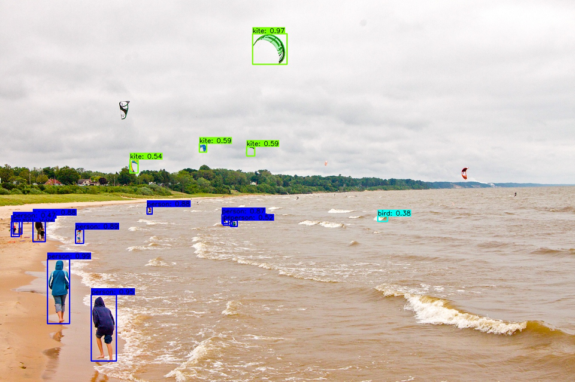

# 4.1.3 静态图片推理

## 图像分类算法—Mobilenet v1

本示例主要实现以下功能：
  1. 加载 `mobilenet v1` 图像分类模型
  2. 读取 `zebra_cls.jpg` 静态图片作为模型的输入
  3. 解析模型输出，得到图片的分类结果

### 运行方法

本示例的完整代码和测试数据安装在 `/app/pydev_demo/01_basic_sample/` 目录下，调用以下命令运行

```shell
cd /app/pydev_demo/01_basic_sample/
sudo python3 ./test_mobilenetv1.py
```

运行成功后，会输出图像的分类结果，如下所示：

```shell
========== Classification result ==========
cls id: 340 Confidence: 0.991851
```

### 示例代码解析

- 导入算法推理库hobot_dnn、numpy和opencv模块

    ```python
    from hobot_dnn import pyeasy_dnn as dnn
    import numpy as np
    import cv2
    ```

- 模型加载
    调用 [load](../pydev_dnn_api.md) 接口加载模型文件，并返回`hobot_dnn.pyeasy_dnn.Model`类的list。

    ```python
    models = dnn.load('../models/mobilenetv1_224x224_nv12.bin')
    ```

    本示例中`mobilenetv1` 模型的输入是`1x3x224x224`数据，格式为`NCHW`。输出是1000个list数据，表示1000个类别的置信度。示例中定义了`print_properties`函数用来输出模型的输入、输出参数：

    ```python
    # print properties of input tensor
    print_properties(models[0].inputs[0].properties)
    # print properties of output tensor
    print_properties(models[0].outputs[0].properties)
    ```

- 数据前处理

    示例打开含有斑马的图像文件`zebra_cls.jpg`，并把图片缩放到符合模型输入的尺寸(244 x 224)：

    ```python
    # open image
    img_file = cv2.imread('./zebra_cls.jpg')
    # get the input tensor size
    h, w = models[0].inputs[0].properties.shape[2], models[0].inputs[0].properties.shape[3]
    print("input tensor size: %d x %d" % (h, w))
    des_dim = (w, h)
    # resize image to inpust size
    resized_data = cv2.resize(img_file, des_dim, interpolation=cv2.INTER_AREA)
    ```

    

    然后通过`bgr2nv12_opencv`函数把bgr格式的图像转换成符合模型输入的`NV12`格式：

    ```python
    nv12_data = bgr2nv12_opencv(resized_data)
    ```

- 模型推理

    调用 [Model](../pydev_dnn_api#model) 类的 `forward` 接口进行算法推理，然后得到一个含有1000个值的list，表示1000个类别的预测概率值。

    ```python
    outputs = models[0].forward(nv12_data)
    ```

- 算法后处理

    算法模型的输出结果需要通过后处理，得到我们需要的类别、检测框等信息。本示例中模型输出对应1000个类别，需要根据置信度进行过滤，并得到正确结果。

    ```python
    print("=" * 10, "Classification result", "=" * 10)
    np.argmax(outputs[0].buffer)
    # output target id and confidence
    print("cls id: %d Confidence: %f" % (np.argmax(outputs[0].buffer), outputs[0].buffer[0][np.argmax(outputs[0].buffer)]))
    ```

    正确运行的结果为：

    ```shell
    ========== Classification result ==========
    cls id: 340 Confidence: 0.991851
    ```


## 目标检测算法—YOLOv3

本示例主要实现以下功能：

  1. 加载 `yolov3_416x416_nv12` 目标检测模型
  2. 读取 `kite.jpg` 静态图片作为模型的输入
  3. 分析算法结果，渲染检测结果

### 运行方法

本示例的完整代码和测试数据安装在 `/app/pydev_demo/06_yolov3_sample/` 目录下，调用以下命令运行

```
cd /app/pydev_demo/06_yolov3_sample/
sudo python3 ./test_yolov3.py
```

运行成功后，会输出目标检测结果，并且输出渲染结果到`result.jpg`文件中，如下图：



## 目标检测算法—YOLOv5{#detection_yolov5}

本示例主要实现以下功能：

1. 加载 `yolov5s_672x672_nv12` 目标检测模型
2. 读取 `kite.jpg` 静态图片作为模型的输入
3. 分析算法结果，渲染检测结果

### 运行方法

本示例的完整代码和测试数据安装在 `/app/pydev_demo/07_yolov5_sample/` 目录下，调用以下命令运行

```
cd /app/pydev_demo/07_yolov5_sample/
sudo python3 ./test_yolov5.py
```

运行成功后，会输出目标检测结果，并且输出渲染结果到`result.jpg`文件中，如下图：


## 图像分割算法—unet

本示例主要实现以下功能：

1. 加载 `mobilenet_unet_1024x2048_nv12` 图像分割模型（cityscapes预训练的分割模型）
2. 读取 `segmentation.png` 静态图片作为模型的输入
3. 分析算法结果，渲染分割结果


### 运行方法

本示例的完整代码和测试数据安装在 `/app/pydev_demo/04_segment_sample/` 目录下，调用以下命令运行

```
cd /app/pydev_demo/04_segment_sample/
sudo python3 ./test_mobilenet_unet.py
```

运行成功后，会输出图像的分割结果，并且输出分割效果图到``segment_result.png``文件中，如下图：

