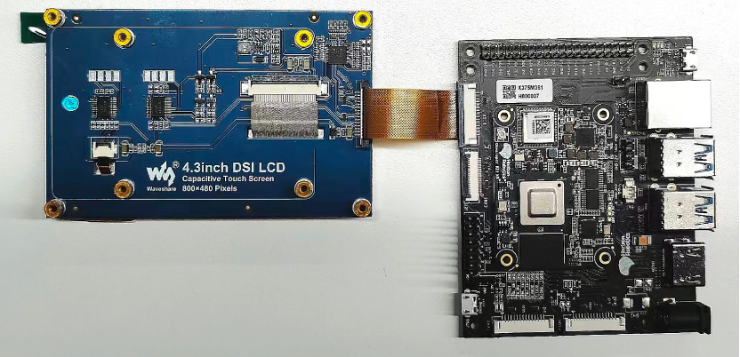

# 显示屏使用

RDK X3 Module载板提供一路MIPI DSI接口，支持多种LCD屏幕的接入。下文以4.3英寸MIPI LCD为例，介绍显示屏接入和使用方法。

屏幕连接方式如下图所示：



:::caution 注意
严禁在开发板未断电的情况下插拔屏幕，否则容易引起短路并烧坏屏幕模组。
:::

由于RDK X3 Module 系统默认采用HDMI输出，需要通过命令切换到LCD显示方式，首先执行下面命令备份`DTB`

```shell
sudo cp /boot/hobot/hobot-x3-cm.dtb /boot/hobot/hobot-x3-cm_backup.dtb
```

执行以下命令确定当前显示类型：

```shell
sudo fdtget /boot/hobot/hobot-x3-cm.dtb /chosen bootargs
```

以`HDMI`为例，执行上述命令将会打印：

```shell
sunrise@ubuntu:~$ sudo fdtget /boot/hobot/hobot-x3-cm.dtb /chosen bootargs
earlycon loglevel=8 kgdboc=ttyS0 video=hobot:x3sdb-hdmi
```

执行以下命令修改`chosen`节点：

```shell
sudo fdtput -t s /boot/hobot/hobot-x3-cm.dtb /chosen bootargs "earlycon loglevel=8 kgdboc=ttyS0 video=hobot:cm480p"
```

执行以下命令打印出修改后的节点，确定修改成功：

```shell
sudo fdtget /boot/hobot/hobot-x3-cm.dtb /chosen bootargs
```


输入以下命令重启开发板：

```shell
sync
sudo reboot
```

此时的显示方式就从`HDMI`切换成`DSI`了。

如果想切回`HDMI`显示，进入内核后，执行下面命令：

```shell
sudo cp /boot/hobot/hobot-x3-cm_backup.dtb /boot/hobot/hobot-x3-cm.dtb
sync
```

然后输入`sudo reboot`重启开发板即可。
