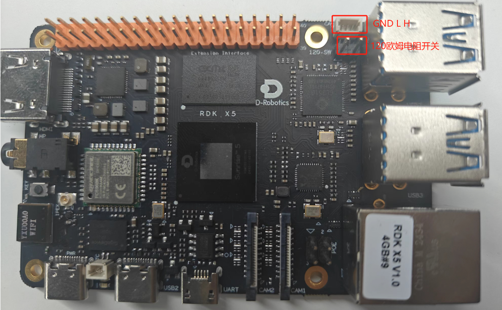
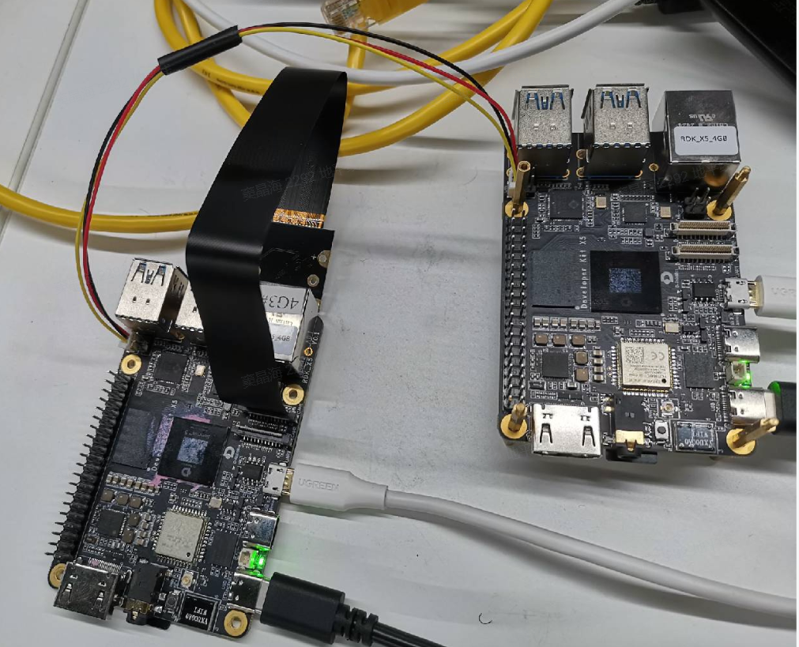

# CAN使用

## 协议简介
**CAN**
CAN 是Controller AreaNetwork 的缩写，中文名为控制器局域网络，是ISO国际标准化的串行通信协议，是一种用于实时应用的串行通讯协议总线，它可以使用双绞线来传输信号，是世界上应用最广泛的现场总线之一。

CAN总线的优点:
- 可靠性高，抗干扰能力强
phy芯片外围基于差分信号和双绞线进行传输，有效抵消电磁干扰;硬件固化的数据链路层能自动解决多节点间时钟不同步问题。

- 具备很强的检错能力
硬件固化的数据链路层包含CRC、位检测等检测能力，几乎能100%检测通信异常。

- 完善的错误管理机制
如报文帧仲裁失败或传输期间被破坏能自动重发;节点在错误严重的情况下，具有自动脱离总线的功能，切断它与总线的联系，不影响总线的正常工作。

- 实时性强
CAN总线具有较高的数据传输速率，能够实时处理和传输大量数据，满足汽车电子控制系统的实时性需求。

- 成本低
CAN总线的硬件成本相对较低，可以降低汽车电子控制系统的整体成本。

- 通信距离远、消息传输速度快
直接通信距离最远可达10km(速率4Kbps以下);通信速率最高可达1Mbps(此时距离最长40m)。

- 支持多主机通信，支持无损仲裁技术
当两个节点同时发布信息时，高优先级报文可不受影响地传输数据。

- 废除"地址”概念，高效灵活
CAN协议的一个最大特点是废除了传统的站地址编码，取而代之的是对通信报文进。

- 行编码
1）CAN构成的网络节点个数是不受限制的，使用上具有很大的灵活性;
2）在总线上增加节点时，不会对总线上已有节点的软硬件及应用层造成影响。

- 结构简单，组网方便，可扩展性强
添加新设备时，只需往双绞线上放就行，无需额外修改线路（反例如SPI等）。

**CAN FD**
市场对提升CAN 总线性能的强烈需求使CAN-FD(Flexible Data rate)应运而生，CAN-FD发扬了CAN 的优点，并弥补了CAN 的不足，其主要特性如下:
- 扩展有效数据场
CAN-FD协议的每帧报文有效数据场可以达到64字节5，而传统的CAN协议只有8字节。这大大增加了数据传输的能力，使得更多的数据可以在单个报文中进行传输。
- 双比特率模式
CAN-FD协议引入了双比特率模式，即在仲裁段使用标称比特率(最高1 Mbit/s)而在数据段使用更高的数据比特率(最高5 Mbit/s)。这种模式可以在保证兼容性的同时，提高数据传输速率。
- 改进的循环冗余校验和填充位计数器
CAN-FD协议采用了改进的循环冗余校验(CRC)和填充位计数器(SBC)，以提高错误检测能力。这些改进增强了数据的完整性和可靠性。
- 取消远程帧的支持
为简化帧结构，CAN-FD协议取消了远程帧的支持。这意味着在CAN-FD网络中，通信是通过数据帧进行的，不再需要远程帧的控制和请求。

## 接口说明

- RDK X5 提供了 CAN 通信接口，并配备了一个 120 欧姆终端电阻开关，当需要启用终端电阻时，只需闭合该开关即可。
- 端子接口型号：SH1.0 1X3P

:::info 注意
如果距离过长（大于1米），速率过大（大于125Kbps），需要闭合 RDK X5 的终端电阻开关，对端设备也要使能120欧姆的电阻。这样做会消除信号反射，保证总线的稳定通信。
:::

## 模块简介
RDK X5集成了TCAN4550
TCAN4550是带有集成 CAN FD 收发器的 CAN FD 控制器，支持高达 8Mbps 的数据速率。此 CAN FD 控制器符合 ISO11898-1:2015 高速控制器局域网 (CAN) 数据链路层的规范，并满足 ISO11898–2:2016 高速CAN 规范的物理层要求。TCAN4550 通过串行外设接口 (SPI) 在 CAN 总线和系统处理器之间提供了一个接口，同时支持经典 CAN 和 CAN FD，并为不支持CAN FD 的处理器实现 端口扩展或 CAN 支持。TCAN4550 提供 CAN FD 收发器功能：传输到总线的差分传输能力和从总线接收的差分接收能力。
- 支持1M的CAN 2M的CAN FD

## 驱动指南
**dts**

  ```bash
  &spi5 {
    status = "okay";
    pinctrl-names = "default";
    pinctrl-0 = <&pinctrl_spi5 &lsio_gpio0_7 &lsio_gpio0_12>;

    tcan4x5x: tcan4x5x@0 {
      compatible = "ti,tcan4x5x";
      reg = <0>;
      #address-cells = <1>;
      #size-cells = <1>;
      spi-max-frequency = <10000000>;
      bosch,mram-cfg = <0x0 0 0 16 0 0 1 1>;
      interrupt-parent = <&ls_gpio0_porta>;
      interrupts = <12 IRQ_TYPE_EDGE_FALLING>;
      reset-gpios = <&ls_gpio0_porta 7 GPIO_ACTIVE_HIGH>;
    };
  };
  ```

**驱动代码**

  ```bash
kernel\drivers\net\can\m_can\tcan4x5x-core.c
  ```

## can-utils工具介绍

can-utils 是一套用于Linux操作系统的开源工具，专门用来处理与CAN（Controller Area Network）总线相关的任务。CAN总线广泛应用于汽车和工业自动化中，用于设备之间的通讯。
这个工具集提供了多种命令行工具，用于发送、接收和处理CAN网络上的数据。比如：
cansend：发送单个CAN帧。
candump：捕获并显示经过CAN接口的数据。
canplayer：重放candump记录的数据。
cansniffer：显示CAN数据的变化。
can-utils 还包括了一些用于高级功能的工具，比如设置CAN硬件过滤器，或者调试CAN设备和网络的工具。这些工具通过命令行界面提供，可以灵活地集成到脚本和自动化系统中。


### 基本使用
**1. candump**
显示、过滤并记录CAN数据

基本用法：
  ```bash
candump can0
  ```
- 显示通过 can0 接口的所有CAN数据。

过滤特定ID：
  ```bash
candump can0,123:7FF
  ```
- 显示ID为123的CAN帧。

记录数据到文件：
  ```bash
candump -l can0
  ```
- 这将把通过 can0 的数据记录到文件中，默认文件名格式为 candump-日期.log。

**2. canplayer**
canplayer 用于回放用 candump 录制的CAN数据日志。

基本用法：
  ```bash
canplayer -I candump.log
  ```
- 将回放文件 candump.log 中记录的CAN数据。

**3. cansend**
用来发送指定的CAN帧

基本用法：
  ```bash
cansend can0 123#1122334455667788
  ```
- 向 can0 接口发送一个ID为123的CAN帧，数据内容为 1122334455667788。

**4. cangen**
生成随机或特定规则的CAN流量，用于测试或模拟。

基本用法：
  ```bash
cangen can0 -I 1A -L 8 -D i -g 10 -n 100
  ```
- 在 can0 上生成100个ID为1A，长度为8字节的递增数据包，每个包之间间隔10毫秒。

**5. cansequence**
发送一系列具有递增载荷的CAN帧，并检查是否有丢帧现象。

基本用法：
  ```bash
cansequence can0
  ```
- 在 can0 上发送并检查一系列递增载荷的CAN帧。

**6. cansniffer**
用于显示CAN数据的变化，这对于调试和理解数据流非常有帮助。
基本用法：
  ```bash
cansniffer can0
  ```
- 监控并显示 can0 接口上CAN数据的任何变化。


## 测试指南

### 回环测试
配置can总线位速率和回环模式
  ```bash
ip link set down can0
ip link set can0 type can bitrate 125000
ip link set can0 type can loopback on
ip link set up can0
  ```

查看can0配置信息
  ```bash
ip -details link show can0
  ```


继续输入接收指令(后台接收，不能阻塞串口，后续还需要输入发送指令)：
  ```bash
candump can0 -L &
  ```
发送测试输入，正常的情况下将立即接收到测试数据：
  ```bash
cansend can0 123#1122334455667788
  ```
测试结果：


### CANFD回环测试

仲裁段波特率为500K，数据场波特率为2M
  ```bash
ip link set can0 down
ip link set can0 type can bitrate 500000 dbitrate 2000000  fd on
ip link set can0 type can loopback on
ip link set can0 up
  ```
发送，接收CAN FD数据
  ```bash
candump can0 -L &
cansend can0 123##300112233445566778899aabbccddeeff
  ```

### 双设备通信测试
**硬件连接**

- GND接GND L接L H接H 

**测试指令**
两台设备配置相同的can总线位速率
  ```bash
ip link set down can0
ip link set can0 type can bitrate 125000
ip link set up can0
  ```
一台设备接收
  ```bash
candump can0 -L
  ```
一台设备发送
  ```bash
cansend can0 123#1122334455667788
  ```

## 应用指南
Linux 提供了SocketCAN 接口，使得 CAN 总线通信近似于和以太网的通信，应用程序开发接口 更加通用，也更加灵活。使用socketCAN就像使用TCP/IP一样。
这里提供一个简单的收发例程：

首先，配置can总线位速率和回环模式
  ```bash
ip link set down can0
ip link set can0 type can bitrate 125000
ip link set can0 type can loopback on
ip link set up can0
  ```

编写程序
  ```bash
#include <stdio.h>
#include <stdlib.h>
#include <string.h>
#include <unistd.h>
#include <linux/can.h>
#include <linux/can/raw.h>
#include <sys/socket.h>
#include <net/if.h>
#include <sys/ioctl.h>
#include <fcntl.h>

int main() {
    int sock;
    struct sockaddr_can addr;
    struct can_frame frame;

    // 创建 Socket
    sock = socket(PF_CAN, SOCK_RAW, CAN_RAW);
    if (sock < 0) {
        perror("Socket");
        return 1;
    }

    // 获取 can0 接口
    struct ifreq ifr;
    strcpy(ifr.ifr_name, "can0");
    ioctl(sock, SIOCGIFINDEX, &ifr);

    // 绑定 Socket
    addr.can_family = PF_CAN;
    addr.can_ifindex = ifr.ifr_ifindex;
    bind(sock, (struct sockaddr *)&addr, sizeof(addr));

    // 发送消息
    frame.can_id = 0x123;
    frame.can_dlc = 4;
    memcpy(frame.data, "\xde\xad\xbe\xef", 4);
    write(sock, &frame, sizeof(struct can_frame));

    // 接收消息
    while (1) {
        int nbytes = read(sock, &frame, sizeof(struct can_frame));
        if (nbytes > 0) {
            printf("Received: ID: 0x%X Data: ", frame.can_id);
            for (int i = 0; i < frame.can_dlc; i++) {
                printf("%02X ", frame.data[i]);
            }
            printf("\n");
        }
    }

    close(sock);
    return 0;
}
  ```

编译和运行
保存代码到`can_loopback.c`文件中。

编译程序：

  ```bash
gcc -o can_loopback can_loopback.c
  ```
运行程序：

  ```bash
sudo ./can_loopback
  ```
以上代码会发送一条 CAN 消息，并不断接收并打印接收到的消息。