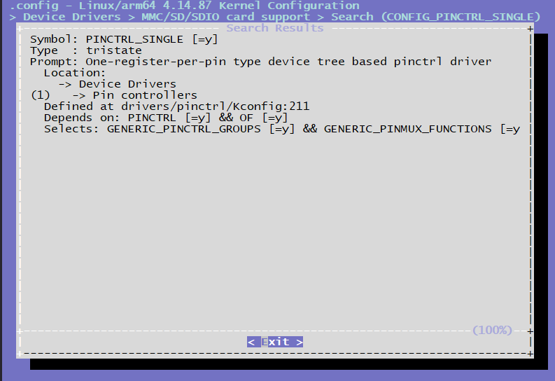

# Pinctrl调试指南

X3 Pinctrl使用Linux Kernel主线代码的pinctl-single作为驱动，主要通过配置DTS来实现pinctrl功能。

## 管脚查询

IO管脚的复用和配置可以在 [datasheets](https://sunrise.horizon.cc/downloads/datasheets/) 查阅《PL-2500-3-X3 PIN SW Reg-V1.2.xls》。

在 《PL-2500-3-X3 PIN SW Reg-V1.2.xls》可以比较直观的查询到管脚的上电默认状态、复用、驱动能力、上下拉、施密特触发配置。

### 驱动代码

```bash
drivers/pinctrl/pinctrl-single.c # pinctrl 驱动代码源文件
include/linux/platform_data/pinctrl-single.h # pinctrl 驱动代码头文件
```

### 内核配置

CONFIG_PINCTRL_SINGLE



### Pinctrl的DTS配置

```c
/* arch/arm64/boot/dts/hobot/hobot-pinctrl-xj3.dtsi */
pinctrl: pinctrl@0xA6004000 {
    compatible = "pinctrl-single";
    reg = <0x0 0xA6004000 0x0 0x200>;
    #pinctrl-cells = <1>;
    #gpio-range-cells = <0x3>;
    pinctrl-single,register-width = <32>;
    pinctrl-single,function-mask = <0x3FF>;
    /* pin base, nr pins & gpio function */
    pinctrl-single,gpio-range = <&range 0 120 3>;

    i2c0_func: i2c0_func {
        pinctrl-single,pins = < 
            0x020   (MUX_F0 | DRIVE2_09MA | SCHMITT2_DIS | PULL2_UP)
            0x024   (MUX_F0 | DRIVE2_09MA | SCHMITT2_DIS | PULL2_UP)
            >;
    };
    ...
}
```

## Pinctrl使用

### 驱动DTS配置

驱动在使用Pinctrl的接口前，需要在DTS里配置相应的pinctrl配置组，当驱动probe的时候，会将"default"对应的这组Pinctrl配置到寄存器里面，而其它组的配置需要在代码里面解析出来，再选择切换使用，以iar为例：

```c
/* arch/arm64/boot/dts/hobot/hobot-xj3.dtsi */
iar: iar@0xA4001000 {
    compatible = "hobot,hobot-iar";
    reg = <0 0xA4301000 0 0x400>, <0 0xA4355000 0 0x1000>;
    clocks = <&iar_pix_clk>, <&iar_ipi_clk>, <&sif_mclk>;
    clock-names = "iar_pix_clk","iar_ipi_clk", "sif_mclk";
    interrupt-parent = <&gic>;
    interrupts = <0 69 4>;
    resets = <&rst 0x40 12>;
    pinctrl-names = "bt_func", "rgb_func", "rgb_gpio_func", "bt1120_voltage_func";
    pinctrl-0 = <&btout_func>;
    pinctrl-1 = <&rgb_func>;
    pinctrl-2 = <&rgb_gpio_func>;
    pinctrl-3 = <&bt1120_1_8v_func>;
    disp_panel_reset_pin = <28>;
    reset-names = "iar";
    status = "disabled";
};
```

iar pinctrl中引用的配置组在arch/arm64/boot/dts/hobot/hobot-pinctrl-xj3.dtsi中，内容如下：

```c
btout_func: btout_func {
    pinctrl-single,pins = <
        0x138   (MUX_F0 | DRIVE1_12MA | SCHMITT2_ENA | PULL2_DOWN) /*BT1120_OUT_CLK*/
        0x13c   (MUX_F0 | DRIVE1_12MA | SCHMITT2_DIS | PULL2_DOWN) /*BT1120_OUT_DAT0*/
        0x140   (MUX_F0 | DRIVE1_12MA | SCHMITT2_DIS | PULL2_DOWN)
        0x144   (MUX_F0 | DRIVE1_12MA | SCHMITT2_DIS | PULL2_DOWN)
        0x148   (MUX_F0 | DRIVE1_12MA | SCHMITT2_DIS | PULL2_DOWN)
        0x14c   (MUX_F0 | DRIVE1_12MA | SCHMITT2_DIS | PULL2_DOWN)
        0x150   (MUX_F0 | DRIVE1_12MA | SCHMITT2_DIS | PULL2_DOWN)
        0x154   (MUX_F0 | DRIVE1_12MA | SCHMITT2_DIS | PULL2_DOWN)
        0x158   (MUX_F0 | DRIVE1_12MA | SCHMITT2_DIS | PULL2_DOWN) /*BT1120_OUT_DAT7*/
        0x15c   (MUX_F0 | DRIVE1_12MA | SCHMITT2_DIS | PULL2_DOWN) /*BT1120_OUT_DAT8*/
        0x160   (MUX_F0 | DRIVE1_12MA | SCHMITT2_DIS | PULL2_DOWN)
        0x164   (MUX_F0 | DRIVE1_12MA | SCHMITT2_DIS | PULL2_DOWN)
        0x168   (MUX_F0 | DRIVE1_12MA | SCHMITT2_DIS | PULL2_DOWN)
        0x16c   (MUX_F0 | DRIVE1_12MA | SCHMITT2_DIS | PULL2_DOWN)
        0x170   (MUX_F0 | DRIVE1_12MA | SCHMITT2_DIS | PULL2_DOWN)
        0x174   (MUX_F0 | DRIVE1_12MA | SCHMITT2_DIS | PULL2_DOWN)
        0x178   (MUX_F0 | DRIVE1_12MA | SCHMITT2_DIS | PULL2_DOWN) /*BT1120_OUT_DAT15*/
        >;
};
```

pinctrl配置组将多个pin配置组合到一起，每个pin的配置包含2列，第一列表示pin脚配置寄存器的偏移地址，值为pin脚号乘以4，例如BT1120_OUT_CLK的Pin脚号为78，因此偏移地址为 78 * 4 = 312 ，转换为16进制就是0x138；第二列表示Pin的功能复用配置 Pin-mux。

### Pin-mux配置

X3 每个芯片的Pin脚支持最多4种功能，在配置某个功能时，客户可以通过寄存器手册查看对应功能的pinmux值，例如Pin脚78的mux配置为0，也就是MUX_F0时Pin的功能为BT1120_OUT_CLK。

```c
/* include/dt-bindings/pinctrl/hobot-xj3.h */
/* MUX functions for pins */
#define MUX_F0          0
#define MUX_F1          1
#define MUX_F2          2
#define MUX_F3          3
```

### 驱动强度配置

X3 每个Pin脚支持配置最大的输出电流，驱动电流的配置在Pin脚配置寄存器中占输出电流的配置主要分为两类，同样的寄存器值在不同类的Pin上表示的驱动电流不一致，例如DRIVE1上0表示3mA，而DRIVE2上表示6mA，具体某个Pin脚属于哪一类，客户可以通过arch/arm64/boot/dts/hobot/hobot-pinctrl-xj3.dtsi来查看，hobot-pinctrl-xj3.dtsi中已经列出了X3芯片的所有pin脚。

```c
/* include/dt-bindings/pinctrl/hobot-xj3.h */
/* drive strength definition */
#define DRIVE_MASK      (4 << 2)
#define DRIVE1_03MA     (0 << 2)
#define DRIVE2_06MA     (0 << 2)
#define DRIVE1_06MA     (1 << 2)
#define DRIVE2_09MA     (1 << 2)
#define DRIVE1_09MA     (2 << 2)
#define DRIVE2_12MA     (2 << 2)
#define DRIVE1_12MA     (3 << 2)
#define DRIVE2_15MA     (3 << 2)
#define DRIVE1_17MA     (4 << 2)
#define DRIVE2_18MA     (4 << 2)
#define DRIVE1_20MA     (5 << 2)
#define DRIVE2_21MA     (5 << 2)
#define DRIVE1_22MA     (6 << 2)
#define DRIVE2_24MA     (6 << 2)
#define DRIVE1_25MA     (7 << 2)
#define DRIVE2_27MA     (7 << 2)
#define DRIVE1_33MA     (8 << 2)
#define DRIVE2_30MA     (8 << 2)
#define DRIVE1_35MA     (9 << 2)
#define DRIVE2_33MA     (9 << 2)
#define DRIVE1_37MA     (10 << 2)
#define DRIVE2_36MA     (10 << 2)
#define DRIVE1_39MA     (11 << 2)
#define DRIVE2_39MA     (11 << 2)
#define DRIVE1_41MA     (12 << 2)
#define DRIVE2_41MA     (12 << 2)
#define DRIVE1_42_5MA   (13 << 2)
#define DRIVE2_42_5MA   (13 << 2)
#define DRIVE1_44MA     (14 << 2)
#define DRIVE2_44MA     (14 << 2)
#define DRIVE1_45MA     (15 << 2)
#define DRIVE2_45MA     (15 << 2)
```

### 上下拉配置

X3J3每个Pin脚也支持上下拉配置，和驱动强度配置类似，上下拉的配置也分为两类，两类需要操作的寄存器bit位置不同，具体Pin脚的上下拉类别，
hobot-pinctrl-xj3.dtsi中已经列出，在客户可以通过hobot-pinctrl-xj3.dtsi查找即可。

```c
/* include/dt-bindings/pinctrl/hobot-xj3.h */
/*
 * PULL1 -> bit7(0==pulldown, 1==pullup)
 * bit6(0==pull disable, 1==pull enable)
 *
 * PULL2 -> bit8(0==pullup enable, 1==pullup enable)
 * bit7(0==pulldown diable, 1==pulldown enable)
*/

/* pin states bits */
#define PULL1_MASK      (3 << 6)
#define PULL2_MASK      (3 << 7)
#define PULL1_EN     (1 << 6)
#define PULL1_DIS       (0)
#define PULL2_DIS       (0)
#define PULL1_UP        (PULL1_EN | (1 << 7))
#define PULL2_UP        (1 << 8)
#define PULL1_DOWN      (PULL1_EN | (0 << 7))
#define PULL2_DOWN      (1 << 7)
```

### 施密特触发配置

X3J3每个Pin脚也支持上下拉配置，和驱动强度配置类似，施密特触发的配置也分为两类，两类需要操作的寄存器bit位置不同，具体Pin脚的施密特触发配置类别，
hobot-pinctrl-xj3.dtsi中已经列出，在客户可以通过hobot-pinctrl-xj3.dtsi查找即可。

```c
/* include/dt-bindings/pinctrl/hobot-xj3.h */

/*
* SCHMITT1 -> bit8(0==diable, 1==enable)
*
* SCHMITT2 -> bit9(0==diable, 1==enable)
*/
/* pin schmitt */
#define SCHMITT1_ENA    (1 << 8)
#define SCHMITT1_DIS    (0 << 8)
 
#define SCHMITT2_ENA    (1 << 9)
#define SCHMITT2_DIS    (0 << 9)
```

### 驱动调用示例代码

驱动先通过Pinctrl-names查找对应的pinctrl state，然后再切换到对应的state。

```c
static int hobot_xxx_probe(struct platform_device *pdev)
{
    ...
    g_xxx_dev->pinctrl = devm_pinctrl_get(&pdev->dev);
    if (IS_ERR(g_xxx_dev->pinctrl)) {
        dev_warn(&pdev->dev, "pinctrl get none\n");
        g_xxx_dev->pins_xxxx = NULL;
    }
    ...
        /* 按照 pinctrl-names lookup state */
        g_xxx_dev->pins_xxxx = pinctrl_lookup_state(g_xxx_dev->pinctrl, "xxx_func");
    if (IS_ERR(g_xxx_dev->pins_xxxx)) {
        dev_info(&pdev->dev, "xxx_func get error %ld\n",
                PTR_ERR(g_xxx_dev->pins_xxxx));
        g_xxx_dev->pins_xxxx = NULL;
    }
    ...
}
int xxxx_pinmux_select(void)
{
    if (!g_xxx_dev->pins_xxxx)
        return -ENODEV;
    /* 切换到对应的state */
        return pinctrl_select_state(g_xxx_dev->pinctrl, g_xxx_dev->pins_xxxx);
}
```

### 用户空间调试

如果在内核配置中打开了Linux Kernel的 CONFIG_DEBUG_FS 选项，并且挂载了debugfs文件系统

```
mount -t debugfs none /sys/kernel/debug
```

那么在用户空间的/sys/kernel/debug/pinctrl/a6004000.pinctrl/目录下有一些节点可以查看pinctrl的信息，例如：

```bash
cat /sys/kernel/debug/pinctrl/a6004000.pinctrl/pinmux-pins
```

可以查看哪些pin脚被配置为配置组。
