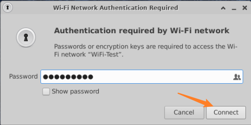
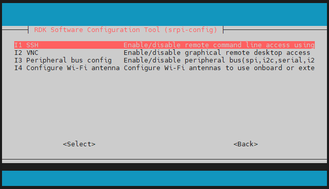
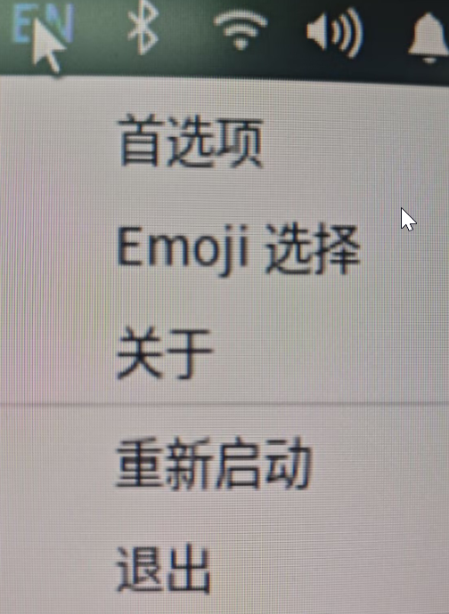
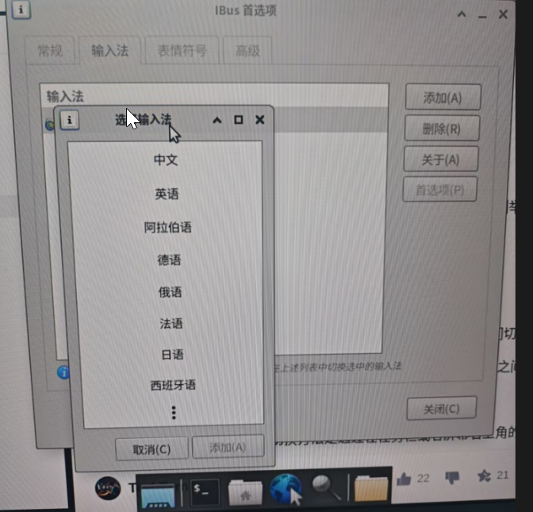
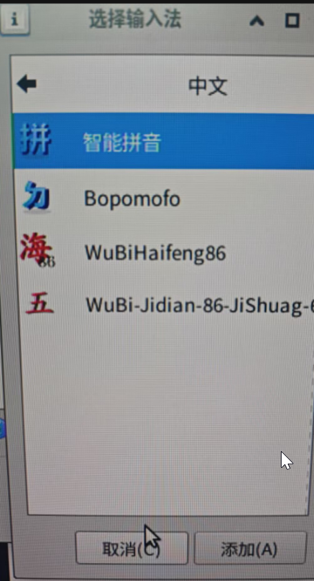
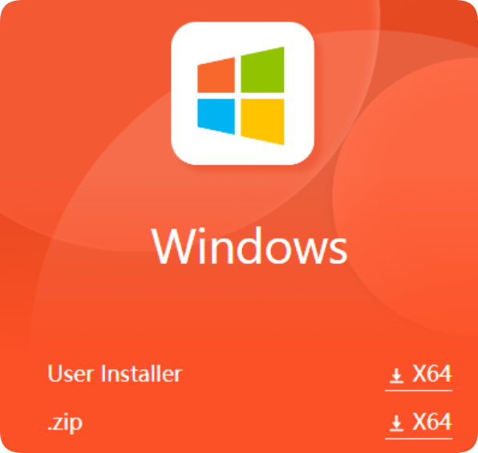
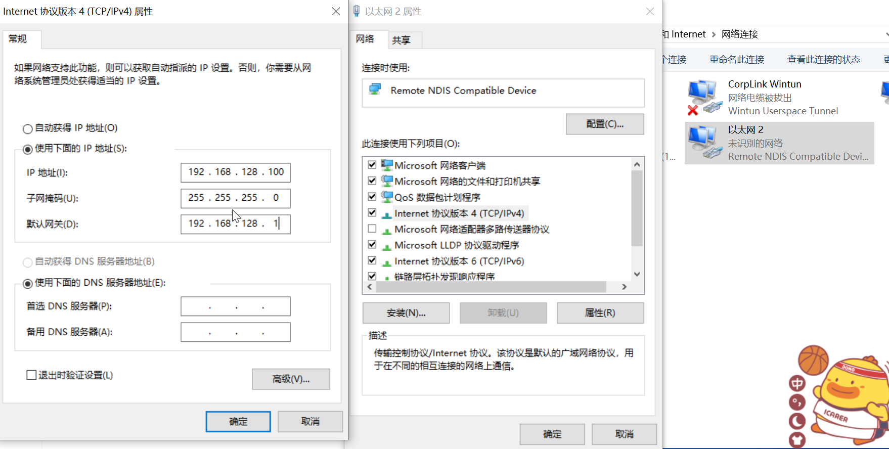

# 1.3 Getting Started Configuration

:::tip

The getting started configuration methods described in this chapter are only supported on RDK X3 and RDK X3 Module models.

The system version should be no lower than `2.1.0`.

:::

```mdx-code-block
import Tabs from '@theme/Tabs';
import TabItem from '@theme/TabItem';
```

## Connecting to Wi-Fi

<Tabs groupId="rdk-type">
<TabItem value="desktop" label="Desktop">

Use the Wi-Fi management tool in the top-right corner of the menu bar to connect to Wi-Fi. As shown in the following figure, click on the Wi-Fi name you need to connect to, and then enter the Wi-Fi password in the pop-up dialog box.




</TabItem>

<TabItem value="server" label="Server">

Use the srpi-config tool to connect to Wi-Fi.

Execute the command `sudo srpi-config`, select System Options -> Wireless LAN, and enter the Wi-Fi name (`SSID`) and password (`passwd`) as prompted.


</TabItem>
</Tabs>

## Enabling SSH Service

The SSH login service is enabled by default in the current system version. Users can use this method to toggle the service.

<Tabs groupId="rdk-type">
<TabItem value="desktop" label="Desktop">
Find the `RDK Configuration` option through the menu bar and click to open it.


Select Interface Options -> SSH, and follow the prompts to enable or disable the `SSH` service.


</TabItem>

<TabItem value="server" label="Server">

Execute the `sudo srpi-config` command to enter the configuration menu. Select Interface Options -> SSH, and follow the prompts to enable or disable the `SSH` service.



</TabItem>

</Tabs>

Please refer to [Remote Login - SSH Login](./remote_login#ssh) for how to use SSH.

## Enable VNC Service

<Tabs groupId="rdk-type">
<TabItem value="desktop" label="Desktop">

Find the `RDK Configuration` option through the menu bar and click to open it.


Select Interface Options -> VNC, and follow the prompts to enable or disable the `VNC` service. When enabling `VNC`, you need to set a login password, which must be an 8-character string composed of numbers and characters.


</TabItem>
</Tabs>

Please refer to [Remote Login - VNC Login](./remote_login#vnc-login) for how to use VNC.

## Set Login Mode

<Tabs groupId="rdk-type">
<TabItem value="desktop" label="Desktop">

For the desktop graphical system, there are four login modes available:

1. Start the graphical interface and automatically log in.
2. Start the graphical interface and require manual login by the user.
3. Character terminal, automatically log in.
4. Character Terminal, User Manual Login

Open `RDK Configuration` through the menu bar. Select System Options -> Boot / Auto Login to enter the following configuration options. Select the corresponding options according to your needs.


It will take effect after restarting.

</TabItem>

<TabItem value="server" label="Server">

Server system, supporting four login modes:

1. Character Terminal, Automatic Login
2. Character Terminal, User Manual Login

Execute the command `sudo srpi-config` to enter the configuration menu. Select System Options -> Boot / Auto Login to enter the following configuration options. Select the corresponding options according to your needs.

It will take effect after restarting.

</TabItem>
</Tabs>

## Set up Chinese Environment

<Tabs groupId="rdk-type">
<TabItem value="desktop" label="Desktop">

Open `RDK Configuration` through the menu bar. Select Localisation Options -> Locale to enter the following configuration.

Step 1: Select the language environment(s) you need (multiple choices), generally choose `en_US.UTF-8 UTF-8` and `zh_CN.UTF-8 UTF-8`. Press Enter to confirm and proceed to the next step.


Step 2: Select the default language environment, choose `zh_CN.UTF-8 UTF-8` for Chinese environment. Press Enter and wait for a while to complete the configuration.

Step 3: Restart the machine to apply the latest configuration. `sudo reboot`

:::tip

After booting, you will be prompted whether to update the names of several commonly used folders in the home directory.
It is recommended to choose `Don't ask me again` `Keep Old Name`, so that the directory names such as `Desktop Documents Downloads` under the user's working directory will not change with the language environment.

:::

</TabItem>

<TabItem value="server" label="Server">

To enter the configuration menu, execute the command `sudo srpi-config`. Select the option "Localisation Options -> Locale" to enter the following configuration.

Step 1: Select the desired language environment(s) (multiple selection). Usually, selecting both `en_US.UTF-8 UTF-8` and `zh_CN.UTF-8 UTF-8` is sufficient. Press Enter to confirm and proceed to the next step.


Step 2: Select the default language environment. For the Chinese language environment, select `zh_CN.UTF-8 UTF-8`. Press Enter to confirm and wait for the configuration to complete.

Step 3: Restart the machine to apply the latest configuration. Execute `sudo reboot`.

</TabItem>
</Tabs>

## 设置中文输入法

<Tabs groupId="rdk-type">
<TabItem value="desktop" label="Desktop">

First step: Locate the EN input method icon on the desktop, right-click and select Preferences.



Step two: Click on 'Input Sources' -> 'Add on the right' -> Select 'Chinese'.



Step three: Select "Intelligent Pinyin" and then you can right-click on the EN in the top right corner to choose "Intelligent Pinyin".



</TabItem>
</Tabs>

## Set up RDK Studio

<Tabs groupId="rdk-type">
<TabItem value="windows" label="Windows">

RDK Studio provides a wealth of features and conveniences for RDK users, including device management, quick start with demos, and quick access to community forums. Next, we will introduce how to uniformly manage and use your own RDX.

Step 1: Download RDK Studio (link: [Download link](https://developer.d-robotics.cc/rdkstudio)), after clicking the download, the page will scroll to the bottom of the download location, you can download either the User Installer or ZIP, and follow the installation steps for offline installation.



Step 2: After opening Studio, the interface includes four left-side menus as follows:

​	（1）`Device Management`: Here you can add and manage devices by clicking `+RDK Device` in the upper right corner.（This example uses a local network IP for connection），For wired connection, please refer to the Bilibili video（[Video Link](https://www.bilibili.com/video/BV1WoSeYiEiz/?spm_id_from=333.999.0.0&vd_source=56a324e1acb7a1639cc8d3358f81292b)），For flash connection, please see the Tip section later in this chapter.

​	（2）`Sample Applications`: Here you can directly install some simple demos to your development board.

​	（3）`Community`: This provides direct access to the D-Robotics community, so you don't have to open a web page to browse.

​	（4）`NodeHub`: This provides direct access to NodeHub, offering a rich set of encapsulated example nodes.

​	（5）`Flashing`: Please refer to section 1.2 for system flashing.


Step 3: Use of Studio integrated tools

​	（1）`Terminal Usage`: Click the terminal button, and the Windows terminal will pop up automatically, enter the password to connect automatically.

​	（2）`Vscode Usage`: Click the Vscode icon to automatically call the local Vscode Remote plugin for connection (PS: You need to have Vscode and the plugin installed locally).

​	（3）`Other Features`: Other features such as Jupyter can be installed as needed.


:::tip

The above operations are universal for various systems. For flash connection operations, note that only the Type C interface of RDX X5 is supported.

The specific usage is as follows:

:::

Step 1: Confirm the development board network

Taking the 3.0 version image of X5 as an example (do not use Beta version images), the IP segment corresponding to the Type C network card is `192.168.128.10`. (PS: For other versions, you can use the connection method mentioned earlier and check with `ifconfig`)

Step 2: Personal PC network settings

Open the control panel of your Windows computer, find Network and Internet——> Network and Sharing Center——> on the left, Change adapter settings

Find the Ethernet card of the board (PS: Plug and unplug the board and computer connection line multiple times to know which one is the development board's Ethernet)——> right-click and select Properties, fill in as shown in the figure below.



Step 3: Flash connection operation

Open RDK Studio Device Management section, add RDK device in the upper right corner——> select flash connection option——> select network (PS: Choose the board card network from the previous step)——> select user——> connect to the WIFI you want to configure for the card——> finally, add note information

Note: Since connecting to WIFI takes time, it may show no WIFI found when the device is added, refresh the card after a while.


</TabItem>

<TabItem value="linux" label="Linux">

:::tip

RDK Studio for Windows is officially available. For those using Linux and Mac, please wait a bit longer as the developers are working hard on it.

:::

</TabItem>


<TabItem value="mac" label="Mac">

:::tip

RDK Studio for Windows is officially available. For those using Linux and Mac, please wait a bit longer as the developers are working hard on it.

:::

</TabItem>

</Tabs>