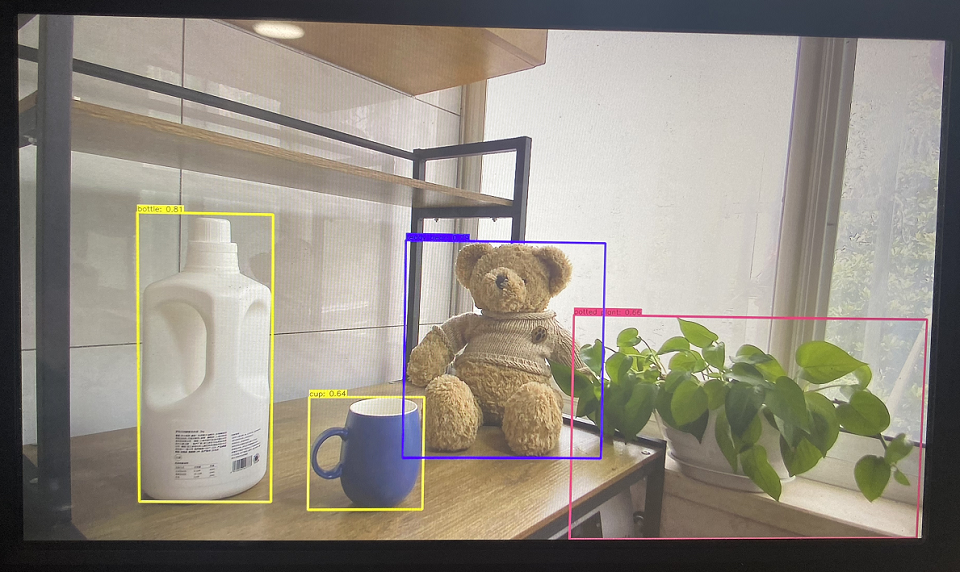

# 3.1.2 Using USB Camera

<iframe width="560" height="315" src="https://www.youtube.com/embed/7xNgU1i2xsk?si=I5jr2TTbLipLmYHR" title="YouTube video player" frameborder="0" allow="accelerometer; autoplay; clipboard-write; encrypted-media; gyroscope; picture-in-picture; web-share" referrerpolicy="strict-origin-when-cross-origin" allowfullscreen></iframe>

The development board is equipped with the `usb_camera_fcos.py` program to test the data path of the USB camera. This example will capture the image data from the USB camera in real time, then run the object detection algorithm, and finally output the merged image data and detection results through the HDMI interface.

## Environment Preparation

  - Connect the USB camera to the development board and make sure that the `/dev/video8` device node is created.
  - Connect the development board to the monitor using an HDMI cable.

## Execution Method
Execute the program with the following command.

  ```shell
  sunrise@ubuntu:~$ cd /app/pydev_demo/02_usb_camera_sample/
  sunrise@ubuntu:/app/pydev_demo/02_usb_camera_sample$ sudo python3 ./usb_camera_fcos.py
  ```

## Expected Result
After running the program, the monitor will display the camera image and the results of the object detection algorithm (object type, confidence), as shown below:  
  

:::tip

For detailed code implementation instructions, please refer to the [USB Camera Inference](../../04_Algorithm_Application/01_pydev_dnn_demo/usb_camera.md) chapter.

:::