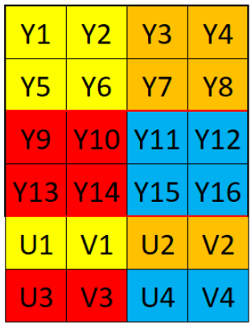

# 4.2.8 Data Layout and Alignment Rules


## Data Layout

To improve computational efficiency, hardware devices adopt special data layout to ensure that the feature maps and kernels used for convolution operations within the same batch are placed adjacent to each other in memory.
Below is a brief introduction to the concept of data layout in the D-Robotics Processor.

Variables in a neural network model can be represented by a 4-dimensional tensor, where each number is an element of this tensor, and we call it the natural layout.
By arranging the elements of different dimensions closely together according to certain rules, we form independent small blocks, and then treat these small blocks as new elements to compose a new 4-dimensional tensor, which we call a tensor with data layout.

Different layouts are used for input and output data, and users can obtain layout description information through APIs. Different layouts cannot be directly compared.

:::info Note
Please note that when performing data layout transformation, if padding is required, it is recommended to set the padding value to zero.

Here we introduce two types of data layout: "NHWC_NATIVE" and "NCHW_NATIVE". Taking "NHWC_NATIVE" as an example, the data layout is as follows:
:::


  | <!-- -->    | <!-- -->    |<!-- --> |
  |-----------|----------------|-----|
  | N0H0W0C0    | N0H0W0C1    | ……    |
  | N0H0W1C0    | N0H0W1C1    | ……    |
  | ……          | ……          | ……    |
  | N0H1W0C0    | N0H1W0C1    | ……    |
  | ……          | ……          | ……    |
  | N1H0W0C0    | N1H0W0C1    | ……    |
  | ……          | ……          | ……    |

A tensor of size N * H * W * C can be represented by the following 4 nested loops:


```C
    for (int32_t n = 0; n < N; n++) {
        for (int32_t h = 0; h < H; h++) {
            for (int32_t w = 0; w < W; w++) {
                for (int32_t c = 0; c < C; c++) {
                    int32_t native_offset = n*H*W*C + h*W*C + w*C + c;
                }
            }
        }
    }
```
Compared to `NCHW_NATIVE`, `NHWC_NATIVE` has a different loop order, but it is not listed separately here.

:::caution
The term native mentioned in the following content specifically refers to this layout.
:::

## BPU Alignment Restriction Rules

This section describes the alignment restriction rules when using BPU.

### Model Input Requirements

BPU does not impose any restrictions on the size or parity of the model inputs. It supports inputs of various sizes, such as 416x416 for models like YOLO, and 227x227 for models like SqueezeNet. 

For NV12 inputs, there is a special requirement that both the width (W) and height (H) must be even, in order to meet the requirement that the UV plane should be half the size of the Y plane.

### Alignment and Valid Data

BPU has alignment restrictions on data. The alignment requirements and the actual layout of the data are represented by ``validShape``, ``alignedShape``, and ``stride`` in ``hbDNNTensorProperties``.

- ``validShape`` represents the valid shape of the data.

- ``alignedShape`` represents the shape that meets the alignment requirements. Due to hardware limitations, ``alignedShape`` is always represented as four-dimensional data.

- ``stride`` represents the strides of each dimension in ``validShape``. For models with NV12 inputs, the ``stride`` value is always 0, because NV12 inputs only require alignment of W by 16.

Currently, the correct layout of four-dimensional model tensors can be obtained using ``validShape`` and ``alignedShape``. If tensors with dimensions larger than four are used in RDK Ultra models, the correct layout can be obtained using ``validShape`` and ``stride``.

## Introduction to NV12

### YUV Format

YUV format is mainly used for optimizing the transmission of color video signals. YUV consists of three components: Y, which represents brightness or grayscale; U and V, which represent chrominance and are responsible for specifying the color of each pixel.

### NV12 Layout

NV12 image format belongs to YUV color space, specifically YUV420SP format. Four Y components share one set of U and V components, with Y arranged continuously and U and V arranged alternately.

The arrangement is as follows:

