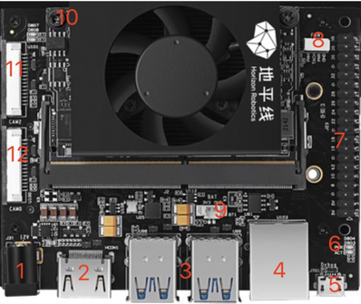
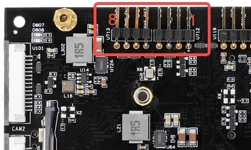

# Interface Documentation

The RDK Ultra development kit provides various peripheral interfaces, including Ethernet, USB, HDMI, MIPI CSI, and 40-pin connectors, making it easy for users to experience functionalities and conduct development and testing. The interface layout is as follows:

| No.  | Interface Function     | No.  | Interface Function       | No.  | Interface Function       |
| ---- | ---------------------- | ---- | ------------------------ | ---- | ------------------------ |
| 1    | Power Interface         | 7    | 40pin Header             | 13   | CAM3 Interface, 24PIN, 4-lane  |
| 2    | HDMI Display Interface  | 8    | PWM Fan Interface        | 14   | CAM1 Interface, 24PIN, 4-lane |
| 3    | 4 x USB 3.0 Interfaces  | 9    | RTC Battery Interface    | 15   | Wi-Fi Card Interface, PCIe M.2-E |
| 4    | Gigabit Ethernet        | 10   | Functional Control Interface | 16   | SSD Interface, PCIe M.2-M  |
| 5    | Debug Interface         | 11   | CAM2 Interface, 15PIN, 2-lane | 17   | SSD Interface, PCIe M.2-M  |
| 6    | Status Indicator        | 12   | CAM0 Interface, 15PIN, 2-lane |     |                          |

## Power Interface

The RDK Ultra development board is powered via the DC interface. It is recommended to use the power adapter included in the kit or a power adapter with at least **12V/5A** output. Once the power is connected, if the red power indicator light (Interface 6) turns on, the device is powered correctly.

## HDMI Interface

The RDK Ultra development board provides one HDMI display interface (Interface 2), supporting up to 1080P resolution. After the development board powers on, it outputs the Ubuntu graphical interface via the HDMI interface. With specific sample programs, the HDMI interface also supports previewing camera or video stream images.

Currently, the HDMI interface supports only the 1080p60 display mode. Additional display modes will be supported in future software versions.

## MIPI CSI Interfaces

The RDK Ultra development board provides four camera interfaces, `CAM 0~3`, allowing for simultaneous connection of up to four MIPI camera modules. The following considerations apply:

1. CAM 0/2 (Interfaces 11/12) use a 15-pin FPC connector and support connecting camera modules such as Raspberry Pi OV5647, IMX219, IMX477, etc.
2. CAM 1/3 (Interfaces 13/14) use a 24-pin FPC connector and support connecting camera modules such as F37, GC4663, IMX415, etc.

The specifications for the camera modules are as follows:

| No.  | Sensor  | Resolution | FOV                | I2C Device Address |
| ---- | ------- | ---------- | ------------------ | ------------------ |
| 1    | GC4663  | 400W       | H:104 V:70 D:113   | 0x29               |
| 2    | JXF37   | 200W       | H:62 V:37 D:68     | 0x40               |
| 3    | IMX219  | 800W       | H:62 V:37 D:68     | 0x10               |
| 4    | IMX477  | 1200W      | H:62 V:37 D:68     | 0x1a               |
| 5    | OV5647  | 500W       | H:62 V:37 D:68     | 0x36               |

Camera modules can be purchased from the community accessories page: [Purchase Link](https://developer.d-robotics.cc/accessory).

:::caution 
Important Note: Never plug or unplug the camera modules while the development board is powered on, as this can easily damage the camera modules.
:::

## USB Interfaces

The RDK Ultra development board provides four USB 3.0 standard interfaces (Interface 3), allowing up to four USB peripherals to be connected simultaneously. Note that the USB interfaces only support Host mode.

## Debug Interface {#debug_uart}

The RDK Ultra development board provides a debug interface (Interface 5), where the core module's debug serial port is converted to a USB interface via the `CH340` chip. This interface can be used for various debugging tasks. The serial parameters on your computer's terminal tool should be configured as follows:

- Baud rate: 921600
- Data bits: 8
- Parity: None
- Stop bits: 1
- Flow control: None

In most cases, the first time you use this interface, you will need to install the `CH340` driver on your computer. You can search for "CH340 serial driver" to download and install it.

## Functional Control Interface

The RDK Ultra development board provides a functional control interface (Interface 10) that allows users to control the functional modes of the core module. The pin functions are as follows:

| Pin No. | Pin Name | Description                         | Usage                           |
| ------- | -------- | ----------------------------------- | ------------------------------- |
| 1       | WAKE_UP  | Used to wake up the development board | Shorted to GND with a jumper cap |
| 2       | GND      | Ground signal                        | GND                             |
| 3       | FC_REC   | Forces the development board into recovery mode | Shorted to GND with a jumper cap |
| 4       | GND      | Ground signal                        | GND                             |
| 5       | SYS_RST  | Resets the system                    | Shorted to GND and then released |
| 6       | GND      | Ground signal                        | GND                             |
| 7       | PWR_EN   | Power enable signal                  | Shorted to GND with a jumper cap to disable power |
| 8       | GND      | Ground signal                        | GND                             |

## 40pin Header Interface

The RDK Ultra development board provides a 40-pin header interface (Interface 7) that supports GPIO, UART, I2C, SPI, I2S, and other interfaces. The detailed pin definitions and multiplexing relationships are shown below:

