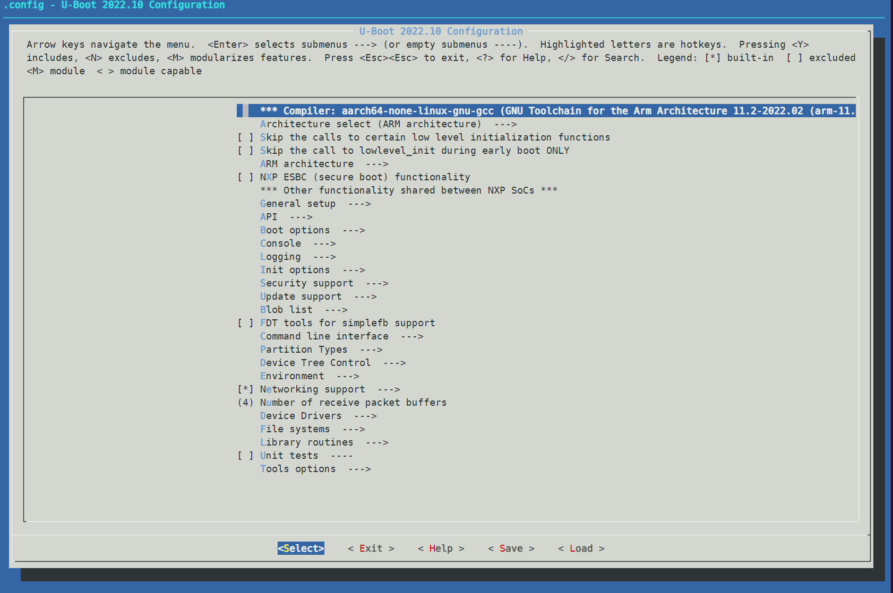
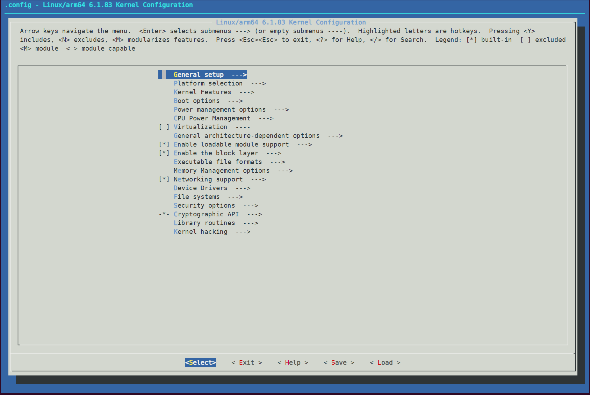

# Configure U-Boot and Kernel Option Parameters

In system software development, it is often necessary to configure U-Boot and Kernel option parameters. This chapter introduces some common configuration methods for user reference.

## Configure U-Boot Option Parameters

:::info Note

The following instructions take modifying the `board_x5_rdk_ubuntu_nand_sdcard_debug_config` configuration file as an example.

The specific U-Boot configuration file used can be checked in the `bootloader/device/.board_config.mk` board-level configuration file under the `HR_UBOOT_CONFIG_FILE` variable value after running `./xbuild.sh lunch`.

:::

### Configuring via the xbuild Command

First, enter the `source/bootloader` directory. The directory structure is as follows:


```
├── build           # System code compilation directory, provides shell scripts for compiling various functional modules, and tools used in compilation
├── device          # Board-level configuration directory, each hardware platform has its corresponding configuration file where you can set compilation options and partition tables
├── miniboot        # Generates the minimal boot firmware containing GPT, MBR, BL2, DDR, and BL3x
├── out             # Compilation output directory
└── uboot           # U-Boot source code

```
`build/xbuild.sh` is the main build script that provides the following commands to help users configure U-Boot options. This command will automatically use the U-Boot configuration file set in the board-level configuration file. After the configuration is completed, it will automatically save the `savedefconfig` and other relevant files.


```
./xbuild.sh uboot menuconfig
```

After the command is successfully executed, the U-Boot graphical configuration interface will open. You can complete the option configurations in this interactive interface, including removing unnecessary features and enabling the required ones.



After completing the configuration in the `menuconfig` interface, select `Exit` to exit. Follow the prompts to choose either `Yes` or `No` to save the changes to the `.config` file.


After exiting the configuration, the configuration file will be automatically saved. The automatic tasks include:


```
# Call `savedefconfig` to clean the configuration file, keep the necessary items, remove dependencies, and generate the `defconfig` file
make savedefconfig

# Use the `defconfig` file to overwrite the U-Boot configuration file set in the board-level configuration file
cp -f defconfig <U-Boot configuration file set in the board-level configuration file>

```

### Manual Configuration

First, navigate to the `source/bootloader/uboot` directory and execute the command `make ARCH=arm64 hobot_x5_rdk_nand_defconfig`. The `make` command will first execute the Makefile in the top-level directory. For targets ending with `config`, there is a common entry point:

```makefile
%config: scripts_basic outputmakefile FORCE
        $(Q)$(MAKE) $(build)=scripts/kconfig $@
```

The expanded command to be executed is:

```
make -f ./scripts/Makefile.build obj=scripts/kconfig hobot_x5_rdk_nand_defconfig
```

After executing this command, a `.config` file will be generated in the root directory of the `uboot` source code.


```bash
make ARCH=arm64 hobot_x5_rdk_nand_defconfig

  HOSTCC  scripts/basic/fixdep
  HOSTCC  scripts/kconfig/conf.o
  YACC    scripts/kconfig/zconf.tab.c
  LEX     scripts/kconfig/zconf.lex.c
  HOSTCC  scripts/kconfig/zconf.tab.o
  HOSTLD  scripts/kconfig/conf
#
# configuration written to .config
#
```

Then, you can execute `make ARCH=arm64 menuconfig` to open the graphical configuration interface for configuring U-Boot options.

After completing the configuration in the `menuconfig` interface, select `Exit` to exit. Follow the prompts to choose either `Yes` or `No` to save the changes to the `.config` file.

Once the configuration is saved, you can run the command `diff .config configs/hobot_x5_rdk_nand_defconfig` to compare the differences and verify that the changes are as expected.

If the modifications are correct, execute `cp .config configs/hobot_x5_rdk_nand_defconfig` to replace the default configuration file.

To clean up the `.config` and other files in the source directory, otherwise, when recompiling the system, you may encounter a warning saying `xxx is not clean, please run 'make mrproper'`:

```bash
make distclean
# or
make mrproper

```

## Configuring Kernel Option Parameters

:::info Note

The following instructions use the `hobot_x5_rdk_ubuntu_defconfig` configuration file as an example.

The specific configuration file used by the kernel can be found in the `kernel_config_file` variable in the `mk_kernel.sh` script.

:::

### Configuring via `mk_kernel` Command

The `mk_kernel.sh` script provides the following commands to help users configure Kernel options. This command will automatically use the Kernel configuration file set in the board-level configuration file. After the configuration is complete, it will automatically perform `savedefconfig` and save the changes.


```
./mk_kernel.sh menuconfig
```
After executing the command successfully, the Kernel graphical configuration interface will open. You can complete the configuration options in this interactive interface, including removing unnecessary features and enabling the required ones.



After completing the configuration in the `menuconfig` interface, select `Exit` to exit. Follow the prompts to choose either `Yes` or `No` to save the changes to the `.config` file.


After exiting the configuration, the configuration file will be automatically saved. The automatic tasks include:


```
# Call `savedefconfig` to clean the configuration file, keep the necessary items, remove dependencies, and generate the `defconfig` file
make savedefconfig

# Use the `defconfig` file to overwrite the Kernel configuration file set in the board-level configuration file
cp defconfig <Kernel configuration file set in the board-level configuration file>

```
### Manual Configuration

The process of configuring the `kernel` via `menuconfig` is the same as configuring `uboot`. The execution steps are as follows:

First, navigate to the `boot/kernel` directory and then follow these steps to configure the `kernel` options.

- Use `hobot_x5_rdk_ubuntu_defconfig` to generate the `.config` file. If a full build has been performed on the source code, the `.config` file will already be configured.


```
make ARCH=arm64 hobot_x5_rdk_ubuntu_defconfig
```

- Execute the following command to modify the configuration


```
make ARCH=arm64 menuconfig
```

- After making the changes, you can first check the differences between the modified and the original configuration.


```
diff .config arch/arm64/configs/hobot_x5_rdk_ubuntu_defconfig
```

- Overwrite the `hobot_x5_rdk_ubuntu_defconfig` with the new configuration.

```
cp .config arch/arm64/configs/hobot_x5_rdk_ubuntu_defconfig
```

- Clean up the `.config` and other files in the source directory; otherwise, when recompiling the system, you may encounter a message saying `xxx is not clean, please run 'make mrproper'`.

```
make distclean
# or
make mrproper
```

